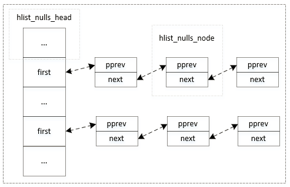
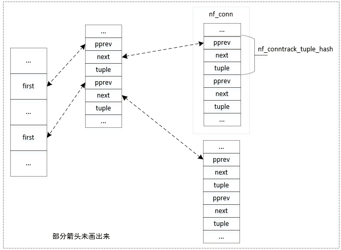

### **简介**

连接跟踪模块只负责跟踪数据包，并不会对包进行更改操作（但会过滤包）。它最重要的两个用途是NAT与状态防火墙。

我们在linux系统中执行以下命令，可以看到连接跟踪表中的条目（每个条目就是一个连接）：

```shell
$ conntrack -L
...
tcp      6 96 TIME_WAIT src=192.168.2.102 dst=172.26.97.7 sport=42660 dport=8080 src=172.26.97.7 dst=192.168.2.102 sport=8080 dport=42660 [ASSURED] mark=0 use=1
...
```

如上，第一列`tcp`表示协议名；第二列`6`表示TCP的协议号；第三列`96`表示这条连接的TTL（秒）；第四列`TIME_WAIT`表示TCP的状态，这一列是扩展信息，并不是每种协议都会有；然后是`src=192.168.2.102 dst=172.26.97.7 sport=42660 dport=8080`，它表示该连接的请求包的四元组；然后是`src=172.26.97.7 dst=192.168.2.102 sport=8080 dport=42660`，它表示该连接的回复包的四元组；`[ASSURED]`表示该连接的状态，说明回复方向的包已经收到过了。

### **重要的数据结构**

连接跟踪的数据结构在下一节中有详细的列出，这里重点介绍一下几个比较重要的数据结构。

> struct nf_conn {}

该结构就是表示上面的一条连接，它包含起始方向的四元组，回复方向的四元组，以及协议号、连接状态、生存时间等信息。具体看下一节的数据结构。

> struct nf_conntrack_tuple {}

上面的四元组和用这个数据结构表示，该数据结构中除了包含四元组以外，还有协议号、方向（起始或回复）等信息。

> struct nf_conntrack_tuple_hash {}

该数据结构的主要作用是，把tuple以双向链表的形式进行存储。

### **连接跟踪表及其存储形式**

我们在使用conntrack命令时，可以查看指定表的连接，比如查看unconfirmed表的内容：`conntrack -L unconfirmed`。在conntrack命令中，共有四张表：

- unconfirmed：未确认表，当一个不属于任何连接的包进入连接跟踪模块后，会新建一条连接（未确认状态），当该数据包从连接模块出去后，连接就会被移到下面的conntrack表即确认表中。unconfirmed表的作用是，当数据包在连接跟踪模块中被Drop后，能够快速地把连接从unconfirmed表删除。
- conntrack：即我们所认知的confirmed表
- expectation：期望表
- dying：

##### **conntrack表（confirmed表）**

上面四张表中，最重要的是conntrack表，这里我们来重点介绍一下它的存储结构。

conntrack表是以hash链表的形式存储在内存中，结构如下：



之所以要用哈希表，是为了降低查询的时间复杂度。比如一个数据包进入连接跟踪模块时，要判断它是否属于某个连接，那就要查找连接。之所以用哈希链表，是为了解决冲突，不同的连接的哈希值可能一样，所以要用链表来把哈希值一样的连接串起来。

上面的图中，链表中的每一个节点是`hlist_nulls_node`，它并不是一个连接(`nf_conn`)，那么连接到底是如何存储的呢？其实，连接真正的存储形式如下：



从上面的图我们可以看出，虽然双向链表的节点为`hlist_nulls_node`，但是实际上双向链表中的节点是连接中的tuplehash（`nf_conn.tuplehash[]`），当我们得到pprev的地址，就可以通过偏移量得到这个tuplehash中tuple的地址，然后根据tuple中的`dst.dir`变量值（`nf_conntrack_tuple`中有`dst.dir`这个变量），知道它是起始方向的tuple，还是回复方向的tuple，然后再根据偏移量就可以得到整个连接（`nf_conn`）的地址。

知道一个结构体中某个元素的地址，然后根据偏移量找到该结构体的起始地址的内核函数（实际上是一个宏）为`container_of`，在[`include/linux/kernel.h`](https://elixir.bootlin.com/linux/v4.4.249/source/include/linux/kernel.h#L814)中。关于该宏的解析可以参考[这些文章](https://zhuanlan.zhihu.com/p/54932270)。

接下来我们看看，插入一条连接的流程。一个连接中有起始方向（`tuplehash[0]`）和回复方向（`tuplehash[1]`）两个方向的tuplehash，这两个tuplehash都要插入到这个哈希链表中去。当插入一个tuplehash时，首先对这个tuplehash中的tuple做哈希，找到链头，然后把这个tuplehash插入到链头之后，即该tuplehash会变成链表中的第一个节点。

`hlist_nulls_node`的插入代码如下，说明为头部插入，代码在[include/linux/hlist_nulls.h](https://elixir.bootlin.com/linux/v4.4.249/source/include/linux/list_nulls.h#L63)文件中：

```c
static inline void hlist_nulls_add_head(struct hlist_nulls_node *n,
					struct hlist_nulls_head *h)
{
	struct hlist_nulls_node *first = h->first;

	n->next = first;
	WRITE_ONCE(n->pprev, &h->first);
	h->first = n;
	if (!is_a_nulls(first))
		WRITE_ONCE(first->pprev, &n->next);
}
```

### **基本流程**

连接跟踪模块有入口与出口，以转发包为例，它的数据流向为`NF_INET_PRE_ROUTING`到`NF_INET_FORWARD`，再到`NF_INET_POST_ROUTING`。根据前面的文章，连接跟踪模块在`NF_INET_PRE_ROUTING`处注册了钩子函数，是连接跟踪的入口；在`NF_INET_POST_ROUTING`处注册了钩子函数，是连接跟踪的出口。入口处的钩子函数`ipv4_conntrack_in()`，最终调用的是`nf_conntrack_in()`。出口处的钩子函数为`ipv4_confirm()`，最终调用的是`nf_conntrack_confirm()`。

我们首先来分析一下当一个新的数据包到达时，连接跟踪的处理流程。

`nf_conntrack_in()`函数的核心代码如下。当一个新的数据包刚进入入口函数时，该数据包不属于任何连接，数据包的nfct字段应该为空（如果不为空，有可能就是该字段表示数据包不要被跟踪）。然后，调用`resolve_normal_ct()`函数。

```c
unsigned int
nf_conntrack_in(struct net *net, u_int8_t pf, unsigned int hooknum,
		struct sk_buff *skb)
{
	...
	// 如果数据包的nfct字段为空，说明它不属于任何连接
	if (skb->nfct) {
		/* Previously seen (loopback or untracked)?  Ignore. */
		tmpl = (struct nf_conn *)skb->nfct;
		// 如果nfct字段的值不是指向一个连接，说明该字段的值表示这个数据包不要被跟踪
		if (!nf_ct_is_template(tmpl)) {
			NF_CT_STAT_INC_ATOMIC(net, ignore);
			return NF_ACCEPT;
		}
		skb->nfct = NULL;
	}
	...	
	ct = resolve_normal_ct(net, tmpl, skb, dataoff, pf, protonum,
			       l3proto, l4proto, &set_reply, &ctinfo);
	...
}
```

我们接着来分析一下`resolve_normal_ct()`函数，该函数的功能就是：**根据数据包在conntrack表中查找连接，如果找到了连接，则将该连接的地址保存在数据的nfct字段中；如果没找到连接，则为数据包生成一个连接，并将连接放在unconfirmed表中，并将连接的地址保存在数据包的nfct字段中**。

它的核心代码如下：

```c
/* On success, returns conntrack ptr, sets skb->nfct and ctinfo */
static inline struct nf_conn *
resolve_normal_ct(struct net *net, struct nf_conn *tmpl,
		  struct sk_buff *skb,
		  unsigned int dataoff,
		  u_int16_t l3num,
		  u_int8_t protonum,
		  struct nf_conntrack_l3proto *l3proto,
		  struct nf_conntrack_l4proto *l4proto,
		  int *set_reply,
		  enum ip_conntrack_info *ctinfo)
{
	...
	// 根据数据包生成一个tuple，保存在指针tuple指向的地址中
	if (!nf_ct_get_tuple(skb, skb_network_offset(skb),
			     dataoff, l3num, protonum, net, &tuple, l3proto,
			     l4proto)) {
		pr_debug("resolve_normal_ct: Can't get tuple\n");
		return NULL;
	}

	...
	// 根据tuple的N元组计算哈希值，注意N元组不包含方向dir，比如TCP为五元组：源地址、目的地址、源端口、目的端口、协议号
	hash = hash_conntrack_raw(&tuple);
	
	// 根据数据包转换得到的tuple及hash值在conntrack表中查找tuplehash节点
	// 注意是tuplehash节点，因为根据前面的介绍，哈希链表中的节点其实是tuplehash
	h = __nf_conntrack_find_get(net, zone, &tuple, hash);
	
	// 如果没有查找到，则生成一条新的连接，并返回这条连接的tuplehash[0]的地址（超始方向）
	if (!h) {
		h = init_conntrack(net, tmpl, &tuple, l3proto, l4proto,
				   skb, dataoff, hash);
		...
	}
	
	// 根据tuplehash的地址，得到连接的地址，实际就是调用了container_of这个宏
	ct = nf_ct_tuplehash_to_ctrack(h);

	...
	skb->nfct = &ct->ct_general;
	skb->nfctinfo = *ctinfo;
	return ct;
}
```

上面我们分析了一个新的数据包到达连接跟踪入口处（`nf_conntrack_in()`）的流程。接下来，我们来看一下这个新的数据包在连接跟踪出口处理的流程。

出口处理的函数为`nf_conntrack_confirm()`函数，它的代码比较简单，主要调用了`__nf_conntrack_confirm()`来对连接进行确认。

```c
/* Confirm a connection: returns NF_DROP if packet must be dropped. */
static inline int nf_conntrack_confirm(struct sk_buff *skb)
{
	struct nf_conn *ct = (struct nf_conn *)skb->nfct;
	int ret = NF_ACCEPT;

	if (ct && !nf_ct_is_untracked(ct)) {
		if (!nf_ct_is_confirmed(ct))
			ret = __nf_conntrack_confirm(skb);
		if (likely(ret == NF_ACCEPT))
			nf_ct_deliver_cached_events(ct);
	}
	return ret;
}
```

我们来看一下`__nf_conntrack_confirm()`函数的代码逻辑，它的部分核心逻辑如下：首先把连接从unconfirmed表中删除，然后将连接插入到哈希链表中

```c
/* Confirm a connection given skb; places it in hash table */
int
__nf_conntrack_confirm(struct sk_buff *skb)
{
	...	
	// 从数据包中获得连接的地址
	ct = nf_ct_get(skb, &ctinfo);

	...	
	// 从unconfirmed或dying表中删除连接
	nf_ct_del_from_dying_or_unconfirmed_list(ct);

	...	
	// 将连接插入到哈希链表中
	__nf_conntrack_hash_insert(ct, hash, reply_hash);
	
	...
}
```

### **总结**

我们对连接跟踪的各种场景做一个简单的总结。

- 数据包无连接

当数据包到达连接跟踪入口时，在conntrack表中查找，看数据包是否属于某个连接，如果不属于，则新建一个连接，并且把这个连接插入到unconfirmed表中，然后把连接的地址记录到数据包的nfct字段中。当数据包到达出口时，出口函数把连接从unconfirmed表中删除，然后插入到conntrack表中。

- 数据包已有连接

当数据包到达连接跟踪入口时，在conntrack表中查找，看数据包是否属于某个连接，如果查找到连接，则把连接的地址存储在数据包的nfct字段中。当数据包到达出口时，检查数据包所属连接是否为confirmed状态，如果已经comfirmed了，则不需要做其他操作。