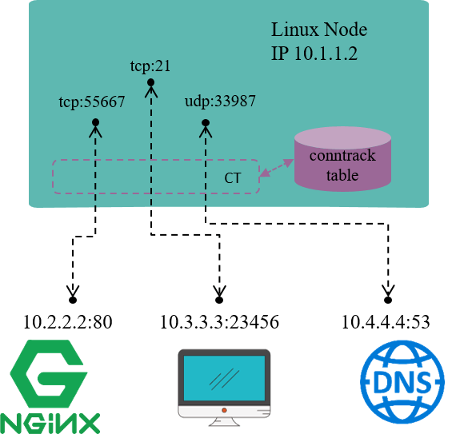
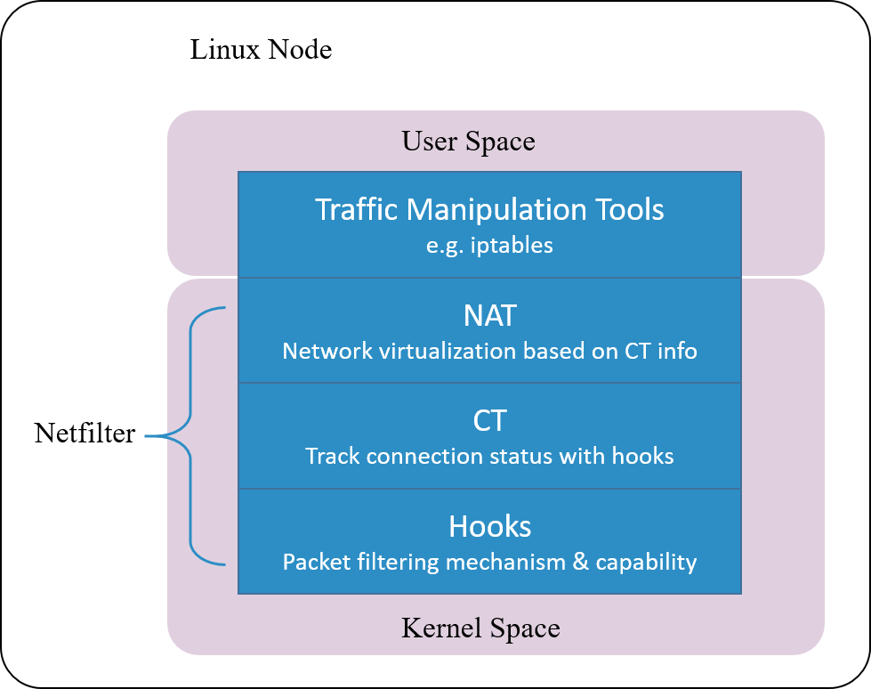
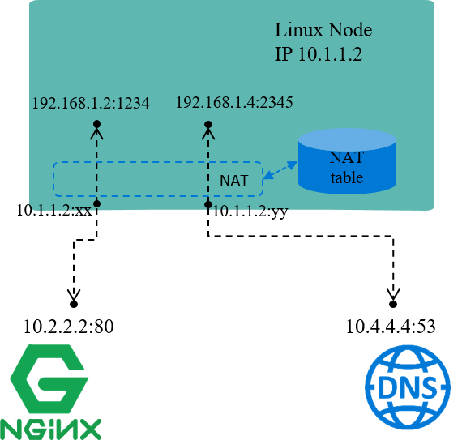
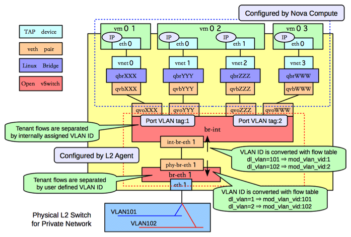
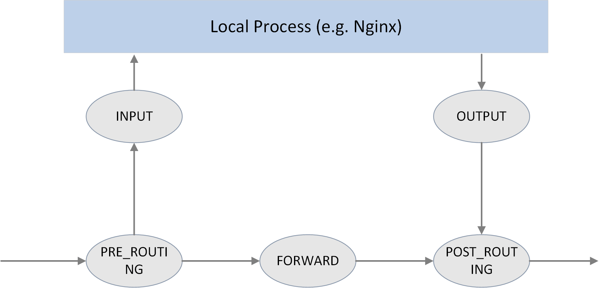
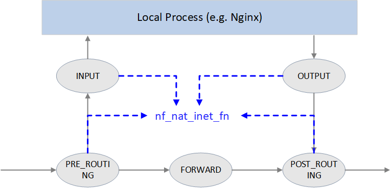

# 连接跟踪（conntrack）：原理、应用及 Linux 内核实现


> This post also provides an [English version](https://arthurchiao.art/blog/conntrack-design-and-implementation/).

- [摘要](https://arthurchiao.art/blog/conntrack-design-and-implementation-zh/#摘要)
- 1 引言
  - [1.1 概念](https://arthurchiao.art/blog/conntrack-design-and-implementation-zh/#11-概念)
  - [1.2 原理](https://arthurchiao.art/blog/conntrack-design-and-implementation-zh/#12-原理)
  - [1.3 设计：Netfilter](https://arthurchiao.art/blog/conntrack-design-and-implementation-zh/#13-设计netfilter)
  - [1.4 设计：进一步思考](https://arthurchiao.art/blog/conntrack-design-and-implementation-zh/#14-设计进一步思考)
  - 1.5 应用
    - 1.5.1 网络地址转换（NAT）
      - [四层负载均衡（L4LB）](https://arthurchiao.art/blog/conntrack-design-and-implementation-zh/#四层负载均衡l4lb)
    - 1.5.2 有状态防火墙
      - [OpenStack 安全组](https://arthurchiao.art/blog/conntrack-design-and-implementation-zh/#openstack-安全组)
  - [1.6 小结](https://arthurchiao.art/blog/conntrack-design-and-implementation-zh/#16-小结)
- 2 Netfilter hook 机制实现
  - 2.1 Netfilter 框架
    - [5 个 hook 点](https://arthurchiao.art/blog/conntrack-design-and-implementation-zh/#5-个-hook-点)
    - [hook 返回值类型](https://arthurchiao.art/blog/conntrack-design-and-implementation-zh/#hook-返回值类型)
    - [hook 优先级](https://arthurchiao.art/blog/conntrack-design-and-implementation-zh/#hook-优先级)
  - [2.2 过滤规则的组织](https://arthurchiao.art/blog/conntrack-design-and-implementation-zh/#22-过滤规则的组织)
- 3 Netfilter conntrack 实现
  - [3.1 重要结构体和函数](https://arthurchiao.art/blog/conntrack-design-and-implementation-zh/#31-重要结构体和函数)
  - 3.2 `struct nf_conntrack_tuple {}`：元组（Tuple）
    - [结构体定义](https://arthurchiao.art/blog/conntrack-design-and-implementation-zh/#结构体定义)
    - [CT 支持的协议](https://arthurchiao.art/blog/conntrack-design-and-implementation-zh/#ct-支持的协议)
  - [3.3 `struct nf_conntrack_l4proto {}`：协议需要实现的方法集合](https://arthurchiao.art/blog/conntrack-design-and-implementation-zh/#33-struct-nf_conntrack_l4proto-协议需要实现的方法集合)
  - [3.4 `struct nf_conntrack_tuple_hash {}`：哈希表项](https://arthurchiao.art/blog/conntrack-design-and-implementation-zh/#34-struct-nf_conntrack_tuple_hash-哈希表项)
  - [3.5 `struct nf_conn {}`：连接（connection）](https://arthurchiao.art/blog/conntrack-design-and-implementation-zh/#35-struct-nf_conn-连接connection)
  - [3.6 `nf_conntrack_in()`：进入连接跟踪](https://arthurchiao.art/blog/conntrack-design-and-implementation-zh/#36-nf_conntrack_in进入连接跟踪)
  - [3.7 `init_conntrack()`：创建新连接记录](https://arthurchiao.art/blog/conntrack-design-and-implementation-zh/#37-init_conntrack创建新连接记录)
  - [3.8 `nf_conntrack_confirm()`：确认包没有被丢弃](https://arthurchiao.art/blog/conntrack-design-and-implementation-zh/#38-nf_conntrack_confirm确认包没有被丢弃)
- 4 Netfilter NAT 实现
  - [4.1 重要数据结构和函数](https://arthurchiao.art/blog/conntrack-design-and-implementation-zh/#41-重要数据结构和函数)
  - [4.2 NAT 模块初始化](https://arthurchiao.art/blog/conntrack-design-and-implementation-zh/#42-nat-模块初始化)
  - [4.3 `struct nf_nat_l3proto {}`：协议相关的 NAT 方法集](https://arthurchiao.art/blog/conntrack-design-and-implementation-zh/#43-struct-nf_nat_l3proto-协议相关的-nat-方法集)
  - [4.4 `struct nf_nat_l4proto {}`：协议相关的 NAT 方法集](https://arthurchiao.art/blog/conntrack-design-and-implementation-zh/#44-struct-nf_nat_l4proto-协议相关的-nat-方法集)
  - 4.5 `nf_nat_inet_fn()`：进入 NAT
    - [Masquerade](https://arthurchiao.art/blog/conntrack-design-and-implementation-zh/#masquerade)
  - [4.6 `nf_nat_packet()`：执行 NAT](https://arthurchiao.art/blog/conntrack-design-and-implementation-zh/#46-nf_nat_packet执行-nat)
- \5. 配置和监控
  - [5.1 查看/加载/卸载 nf_conntrack 模块](https://arthurchiao.art/blog/conntrack-design-and-implementation-zh/#51-查看加载卸载-nf_conntrack-模块)
  - [5.2 sysctl 配置项](https://arthurchiao.art/blog/conntrack-design-and-implementation-zh/#52-sysctl-配置项)
  - 5.3 监控
    - [丢包监控](https://arthurchiao.art/blog/conntrack-design-and-implementation-zh/#丢包监控)
    - [conntrack table 使用量监控](https://arthurchiao.art/blog/conntrack-design-and-implementation-zh/#conntrack-table-使用量监控)
- \6. 常见问题
  - 6.1 连接太多导致 conntrack table 被打爆
    - 现象
      - [业务层（应用层）现象](https://arthurchiao.art/blog/conntrack-design-and-implementation-zh/#业务层应用层现象)
      - [网络层现象](https://arthurchiao.art/blog/conntrack-design-and-implementation-zh/#网络层现象)
      - [操作系统层现象](https://arthurchiao.art/blog/conntrack-design-and-implementation-zh/#操作系统层现象)
    - [确认 conntrack table 被打爆](https://arthurchiao.art/blog/conntrack-design-and-implementation-zh/#确认-conntrack-table-被打爆)
    - [解决方式](https://arthurchiao.art/blog/conntrack-design-and-implementation-zh/#解决方式)
- [7. 总结](https://arthurchiao.art/blog/conntrack-design-and-implementation-zh/#7-总结)
- \8. 附录
  - [8.1 第一个 SYN 包的重传间隔计算（Linux 4.19.118 实现）](https://arthurchiao.art/blog/conntrack-design-and-implementation-zh/#81-第一个-syn-包的重传间隔计算linux-419118-实现)
  - [8.2 根据 nf_conntrack_max 计算 conntrack 模块所需的内存](https://arthurchiao.art/blog/conntrack-design-and-implementation-zh/#82-根据-nf_conntrack_max-计算-conntrack-模块所需的内存)
- [References](https://arthurchiao.art/blog/conntrack-design-and-implementation-zh/#references)

## 摘要

本文介绍连接跟踪（connection tracking，conntrack，CT）的原理，应用，及其在 Linux 内核中的实现。

代码分析基于内核 `4.19`。为使行文简洁，所贴代码只保留了核心逻辑，但都给出了代码 所在的源文件，如有需要请查阅。

水平有限，文中不免有错误之处，欢迎指正交流。

# 1 引言

连接跟踪是许多网络应用的基础。例如，Kubernetes Service、ServiceMesh sidecar、 软件四层负载均衡器 LVS/IPVS、Docker network、OVS、iptables 主机防火墙等等，都依赖 连接跟踪功能。

## 1.1 概念

连接跟踪，顾名思义，就是**跟踪（并记录）连接的状态**。



Fig 1.1. 连接跟踪及其内核位置示意图

例如，上图是一台 IP 地址为 `10.1.1.2` 的 Linux 机器，我们能看到这台机器上有三条 连接：

1. 机器访问外部 HTTP 服务的连接（目的端口 80）
2. 外部访问机器内 FTP 服务的连接（目的端口 21）
3. 机器访问外部 DNS 服务的连接（目的端口 53）

连接跟踪所做的事情就是发现并跟踪这些连接的状态，具体包括：

- 从数据包中提取**元组**（tuple）信息，辨别**数据流**（flow）和对应的**连接**（connection）
- 为所有连接维护一个**状态数据库**（conntrack table），例如连接的创建时间、发送 包数、发送字节数等等
- 回收过期的连接（GC）
- 为更上层的功能（例如 NAT）提供服务

需要注意的是，**连接跟踪中所说的“连接”，概念和 TCP/IP 协议中“面向连接”（ connection oriented）的“连接”并不完全相同**，简单来说：

- TCP/IP 协议中，连接是一个四层（Layer 4）的概念。
  - TCP 是有连接的，或称面向连接的（connection oriented），发送出去的包都要求对端应答（ACK），并且有重传机制
  - UDP 是无连接的，发送的包无需对端应答，也没有重传机制
- CT 中，一个元组（tuple）定义的一条数据流（flow ）就表示一条连接（connection）。
  - 后面会看到 UDP 甚至是 **ICMP 这种三层协议在 CT 中也都是有连接记录的**
  - 但**不是所有协议都会被连接跟踪**

本文中用到“连接”一词时，大部分情况下指的都是后者，即“连接跟踪”中的“连接”。

## 1.2 原理

了解以上概念之后，我们来思考下连接跟踪的技术原理。

要跟踪一台机器的所有连接状态，就需要

1. **拦截（或称过滤）流经这台机器的每一个数据包，并进行分析**。
2. 根据这些信息**建立**起这台机器上的**连接信息数据库**（conntrack table）。
3. 根据拦截到的包信息，不断更新数据库

例如，

1. 拦截到一个 TCP `SYNC` 包时，说明正在尝试建立 TCP 连接，需要创建一条新 conntrack entry 来记录这条连接
2. 拦截到一个属于已有 conntrack entry 的包时，需要更新这条 conntrack entry 的收发包数等统计信息

除了以上两点功能需求，还要考虑**性能问题**，因为连接跟踪要对每个包进行过滤和分析 。性能问题非常重要，但不是本文重点，后面介绍实现时会进一步提及。

之外，这些功能最好还有配套的管理工具来更方便地使用。

## 1.3 设计：Netfilter

**Linux 的连接跟踪是在 [Netfilter](https://en.wikipedia.org/wiki/Netfilter) 中实现的。**



Fig 1.2. Netfilter architecture inside Linux kernel

[Netfilter](https://en.wikipedia.org/wiki/Netfilter) 是 Linux 内核中一个对数据 包进行**控制、修改和过滤**（manipulation and filtering）的框架。它在内核协议 栈中设置了若干hook 点，以此对数据包进行拦截、过滤或其他处理。

> 说地更直白一些，hook 机制就是在数据包的必经之路上设置若干检测点，所有到达这 些检测点的包都必须接受检测，根据检测的结果决定：
>
> 1. 放行：不对包进行任何修改，退出检测逻辑，继续后面正常的包处理
> 2. 修改：例如修改 IP 地址进行 NAT，然后将包放回正常的包处理逻辑
> 3. 丢弃：安全策略或防火墙功能
>
> 连接跟踪模块只是完成连接信息的采集和录入功能，并不会修改或丢弃数据包，后者是其 他模块（例如 NAT）基于 Netfilter hook 完成的。

Netfilter 是最古老的内核框架之一，1998 年开始开发，2000 年合并到 `2.4.x` 内 核主线版本 [5]。

## 1.4 设计：进一步思考

现在提到连接跟踪（conntrack），可能首先都会想到 Netfilter。但由上节讨论可知， 连接跟踪概念是独立于 Netfilter 的，**Netfilter 只是 Linux 内核中的一种连接跟踪实现**。

换句话说，**只要具备了 hook 能力，能拦截到进出主机的每个包，完全可以在此基础上自 己实现一套连接跟踪**。


Fig 1.3. Cilium's conntrack and NAT architectrue

云原生网络方案 Cilium 在 `1.7.4+` 版本就实现了这样一套独立的连接跟踪和 NAT 机制 （完备功能需要 Kernel `4.19+`）。其基本原理是：

1. 基于 BPF hook 实现数据包的拦截功能（等价于 netfilter 里面的 hook 机制）
2. 在 BPF hook 的基础上，实现一套全新的 conntrack 和 NAT

因此，即便[卸载 Netfilter](https://github.com/cilium/cilium/issues/12879) ，也不会影响 Cilium 对 Kubernetes ClusterIP、NodePort、ExternalIPs 和 LoadBalancer 等功能的支持 [2]。

由于这套连接跟踪机制是独立于 Netfilter 的，因此它的 conntrack 和 NAT 信息也没有 存储在内核的（也就是 Netfilter 的）conntrack table 和 NAT table。所以常规的 `conntrack/netstats/ss/lsof` 等工具是看不到的，要使用 Cilium 的命令，例如：

```shell
$ cilium bpf nat list
$ cilium bpf ct list global
```

配置也是独立的，需要在 Cilium 里面配置，例如命令行选项 `--bpf-ct-tcp-max`。

另外，本文会多次提到连接跟踪模块和 NAT 模块独立，但**出于性能考虑，具体实现中 二者代码可能是有耦合的**。例如 Cilium 做 conntrack 的垃圾回收（GC）时就会顺便把 NAT 里相应的 entry 回收掉，而非为 NAT 做单独的 GC。

## 1.5 应用

来看几个 conntrack 的具体应用。

### 1.5.1 网络地址转换（NAT）

网络地址转换（NAT），名字表达的意思也比较清楚：对（数据包的）网络地址（`IP + Port`）进行转换。



Fig 1.4. NAT 及其内核位置示意图

例如上图中，机器自己的 IP `10.1.1.2` 是能与外部正常通信的，但 `192.168` 网段是私有 IP 段，外界无法访问，也就是说源 IP 地址是 `192.168` 的包，其**应答包是无 法回来的**。因此，

- 当源地址为 `192.168` 网段的包要出去时，机器会先将源 IP 换成机器自己的 `10.1.1.2` 再发送出去；
- 收到应答包时，再进行相反的转换。

这就是 NAT 的基本过程。

Docker 默认的 `bridge` 网络模式就是这个原理 [4]。每个容器会分一个私有网段的 IP 地址，这个 IP 地址可以在宿主机内的不同容器之间通信，但容器流量出宿主机时要进行 NAT。

NAT 又可以细分为几类：

- SNAT：对源地址（source）进行转换
- DNAT：对目的地址（destination）进行转换
- Full NAT：同时对源地址和目的地址进行转换

以上场景属于 SNAT，将不同私有 IP 都映射成同一个“公有 IP”，以使其能访问外部网络服 务。这种场景也属于正向代理。

NAT 依赖连接跟踪的结果。连接跟踪**最重要的使用场景**就是 NAT。

#### 四层负载均衡（L4LB）

再将范围稍微延伸一点，讨论一下 NAT 模式的四层负载均衡。

四层负载均衡是根据包的四层信息（例如 `src/dst ip, src/dst port, proto`）做流量分发。

VIP（Virtual IP）是四层负载均衡的一种实现方式：

- 多个后端真实 IP（Real IP）挂到同一个虚拟 IP（VIP）上
- 客户端过来的流量先到达 VIP，再经负载均衡算法转发给某个特定的后端 IP

如果在 VIP 和 Real IP 节点之间使用的 NAT 技术（也可以使用其他技术），那客户端访 问服务端时，L4LB 节点将做双向 NAT（Full NAT），数据流如下图所示：


Fig 1.5. L4LB: Traffic path in NAT mode [3]

### 1.5.2 有状态防火墙

有状态防火墙（stateful firewall）是相对于早期的**无状态防火墙**（stateless firewall）而言的：早期防火墙只能写 `drop syn to port 443` 或者 `allow syn to port 80` 这种非常简单直接 的规则，**没有 flow 的概念**，因此无法实现诸如 **“如果这个 ack 之前已经有 syn， 就 allow，否则 drop”** 这样的规则，使用非常受限 [6]。

显然，要实现有状态防火墙，就必须记录 flow 和状态，这正是 conntrack 做的事情。

来看个更具体的防火墙应用：OpenStack 主机防火墙解决方案 —— 安全组（security group）。

#### OpenStack 安全组

简单来说，安全组实现了**虚拟机级别**的安全隔离，具体实现是：在 node 上连接 VM 的 网络设备上做有状态防火墙。在当时，最能实现这一功能的可能就是 Netfilter/iptables。

回到宿主机内网络拓扑问题： OpenStack 使用 OVS bridge 来连接一台宿主机内的所有 VM。 如果只从网络连通性考虑，那每个 VM 应该直接连到 OVS bridge `br-int`。但这里问题 就来了 [7]：

- （较早版本的）OVS 没有 conntrack 模块，
- Linux 中有 conntrack 模块，但基于 conntrack 的防火墙**工作在 IP 层**（L3），通过 iptables 控制，
- 而 **OVS 是 L2 模块**，无法使用 L3 模块的功能，

最终结果是：无法在 OVS （连接虚拟机）的设备上做防火墙。

所以，2016 之前 OpenStack 的解决方案是，在每个 OVS 和 VM 之间再加一个 Linux bridge ，如下图所示，



Fig 1.6. Network topology within an OpenStack compute node, picture from [Sai's Blog](https://thesaitech.wordpress.com/2017/09/24/how-to-trace-the-tap-interfaces-and-linux-bridges-on-the-hypervisor-your-openstack-vm-is-on/)

Linux bridge 也是 L2 模块，按道理也无法使用 iptables。但是，**它有一个 L2 工具 ebtables，能够跳转到 iptables**，因此间接支持了 iptables，也就能用到 Netfilter/iptables 防火墙的功能。

这种暴力堆砌的方式不仅丑陋、增加网络复杂性，而且会导致性能问题。因此， RedHat 在 2016 年提出了一个 OVS conntrack 方案 [7]，从那以后，才有可能干掉 Linux bridge 而仍然具备安全组的功能。

## 1.6 小结

以上是理论篇，接下来看一下内核实现。

# 2 Netfilter hook 机制实现

Netfilter 由几个模块构成，其中最主要的是**连接跟踪**（CT）模块和**网络地址转换**（NAT）模块。

CT 模块的主要职责是识别出可进行连接跟踪的包。 CT 模块独立于 NAT 模块，但主要目的是服务于后者。

## 2.1 Netfilter 框架

### 5 个 hook 点



图 2.1. The 5 hook points in netfilter framework

如上图所示，Netfilter 在内核协议栈的包处理路径上提供了 5 个 hook 点，分别是：

```c
// include/uapi/linux/netfilter_ipv4.h

#define NF_IP_PRE_ROUTING    0 /* After promisc drops, checksum checks. */
#define NF_IP_LOCAL_IN       1 /* If the packet is destined for this box. */
#define NF_IP_FORWARD        2 /* If the packet is destined for another interface. */
#define NF_IP_LOCAL_OUT      3 /* Packets coming from a local process. */
#define NF_IP_POST_ROUTING   4 /* Packets about to hit the wire. */
#define NF_IP_NUMHOOKS       5
```

用户可以在这些 hook 点注册自己的处理函数（handlers）。当有数据包经过 hook 点时， 就会调用相应的 handlers。

> 另外还有一套 `NF_INET_` 开头的定义，`include/uapi/linux/netfilter.h`。 这两套是等价的，从注释看，`NF_IP_` 开头的定义可能是为了保持兼容性。
>
> ```c
> enum nf_inet_hooks {
>     NF_INET_PRE_ROUTING,
>     NF_INET_LOCAL_IN,
>     NF_INET_FORWARD,
>     NF_INET_LOCAL_OUT,
>     NF_INET_POST_ROUTING,
>     NF_INET_NUMHOOKS
> };
> ```

### hook 返回值类型

hook 函数对包进行判断或处理之后，需要返回一个判断结果，指导接下来要对这个包做什 么。可能的结果有：

```c
// include/uapi/linux/netfilter.h

#define NF_DROP   0  // 已丢弃这个包
#define NF_ACCEPT 1  // 接受这个包，结束判断，继续下一步处理
#define NF_STOLEN 2  // 临时 hold 这个包，不用再继续穿越协议栈了。常见的情形是缓存分片之后的包（等待重组）
#define NF_QUEUE  3  // 应当将包放到队列
#define NF_REPEAT 4  // 当前处理函数应当被再次调用
```

### hook 优先级

每个 hook 点可以注册多个处理函数（handler）。在注册时必须指定这些 handlers 的**优先级**，这样触发 hook 时能够根据优先级依次调用处理函数。

## 2.2 过滤规则的组织

`iptables` 是配置 Netfilter 过滤功能的用户空间工具。为便于管理， 过滤规则按功能分为若干 table：

- raw
- filter
- nat
- mangle

这不是本文重点。更多信息可参考 [(译) 深入理解 iptables 和 netfilter 架构](https://arthurchiao.art/blog/deep-dive-into-iptables-and-netfilter-arch-zh/)

# 3 Netfilter conntrack 实现

连接跟踪模块用于维护**可跟踪协议**（trackable protocols）的连接状态。 也就是说，连接跟踪**针对的是特定协议的包，而不是所有协议的包**。 稍后会看到它支持哪些协议。

## 3.1 重要结构体和函数

重要结构体：

- ```plaintext
  struct nf_conntrack_tuple {}
  ```

  : 定义一个 tuple。

  - ```plaintext
    struct nf_conntrack_man {}
    ```

    ：tuple 的 manipulable part。

    - `struct nf_conntrack_man_proto {}`：manipulable part 中协议相关的部分。

- `struct nf_conntrack_l4proto {}`: 支持连接跟踪的**协议需要实现的方法集**（以及其他协议相关字段）。

- `struct nf_conntrack_tuple_hash {}`：哈希表（conntrack table）中的表项（entry）。

- `struct nf_conn {}`：**定义一个 flow**。

重要函数：

- `hash_conntrack_raw()`：根据 tuple 计算出一个 32 位的哈希值（hash key）。

- `nf_conntrack_in()`：**连接跟踪模块的核心，包进入连接跟踪的地方**。

- `resolve_normal_ct() -> init_conntrack() -> ct = __nf_conntrack_alloc(); l4proto->new(ct)`

  创建一个新的连接记录（conntrack entry），然后初始化。

- `nf_conntrack_confirm()`：确认前面通过 `nf_conntrack_in()` 创建的新连接（是否被丢弃）。

## 3.2 `struct nf_conntrack_tuple {}`：元组（Tuple）

Tuple 是连接跟踪中最重要的概念之一。

**一个 tuple 定义一个单向（unidirectional）flow**。内核代码中有如下注释：

> //include/net/netfilter/nf_conntrack_tuple.h
>
> A `tuple` is a structure containing the information to uniquely identify a connection. ie. if two packets have the same tuple, they are in the same connection; if not, they are not.

### 结构体定义

```c
//include/net/netfilter/nf_conntrack_tuple.h

// 为方便 NAT 的实现，内核将 tuple 结构体拆分为 "manipulatable" 和 "non-manipulatable" 两部分
// 下面结构体中的 _man 是 manipulatable 的缩写
                                               // ude/uapi/linux/netfilter.h
                                               union nf_inet_addr {
                                                   __u32            all[4];
                                                   __be32           ip;
                                                   __be32           ip6[4];
                                                   struct in_addr   in;
                                                   struct in6_addr  in6;
/* manipulable part of the tuple */         /  };
struct nf_conntrack_man {                  /
    union nf_inet_addr           u3; -->--/
    union nf_conntrack_man_proto u;  -->--\
                                           \   // include/uapi/linux/netfilter/nf_conntrack_tuple_common.h
    u_int16_t l3num; // L3 proto            \  // 协议相关的部分
};                                            union nf_conntrack_man_proto {
                                                  __be16 all;/* Add other protocols here. */

                                                  struct { __be16 port; } tcp;
                                                  struct { __be16 port; } udp;
                                                  struct { __be16 id;   } icmp;
                                                  struct { __be16 port; } dccp;
                                                  struct { __be16 port; } sctp;
                                                  struct { __be16 key;  } gre;
                                              };

struct nf_conntrack_tuple { /* This contains the information to distinguish a connection. */
    struct nf_conntrack_man src;  // 源地址信息，manipulable part
    struct {
        union nf_inet_addr u3;
        union {
            __be16 all; /* Add other protocols here. */

            struct { __be16 port;         } tcp;
            struct { __be16 port;         } udp;
            struct { u_int8_t type, code; } icmp;
            struct { __be16 port;         } dccp;
            struct { __be16 port;         } sctp;
            struct { __be16 key;          } gre;
        } u;
        u_int8_t protonum; /* The protocol. */
        u_int8_t dir;      /* The direction (for tuplehash) */
    } dst;                       // 目的地址信息
};
```

**Tuple 结构体中只有两个字段 src 和 dst**，分别保存源和目的信息。`src` 和 `dst` 自身也是结构体，能保存不同类型协议的数据。以 IPv4 UDP 为例，五元组分别保存在如下字段：

- `dst.protonum`：协议类型
- `src.u3.ip`：源 IP 地址
- `dst.u3.ip`：目的 IP 地址
- `src.u.udp.port`：源端口号
- `dst.u.udp.port`：目的端口号

### CT 支持的协议

从以上定义可以看到，连接跟踪模块**目前只支持以下六种协议**：TCP、UDP、ICMP、DCCP、SCTP、GRE。

**注意其中的 ICMP 协议**。大家可能会认为，连接跟踪模块依据包的三层和四层信息做 哈希，而 ICMP 是三层协议，没有四层信息，因此 ICMP 肯定不会被 CT 记录。但**实际上 是会的**，上面代码可以看到，ICMP 使用了其头信息中的 ICMP `type`和 `code` 字段来 定义 tuple。

## 3.3 `struct nf_conntrack_l4proto {}`：协议需要实现的方法集合

支持连接跟踪的协议都需要实现 `struct nf_conntrack_l4proto {}` 结构体 中定义的方法，例如 `pkt_to_tuple()`。

```c
// include/net/netfilter/nf_conntrack_l4proto.h

struct nf_conntrack_l4proto {
    u_int16_t l3proto; /* L3 Protocol number. */
    u_int8_t  l4proto; /* L4 Protocol number. */

    // 从包（skb）中提取 tuple
    bool (*pkt_to_tuple)(struct sk_buff *skb, ... struct nf_conntrack_tuple *tuple);

    // 对包进行判决，返回判决结果（returns verdict for packet）
    int (*packet)(struct nf_conn *ct, const struct sk_buff *skb ...);

    // 创建一个新连接。如果成功返回 TRUE；如果返回的是 TRUE，接下来会调用 packet() 方法
    bool (*new)(struct nf_conn *ct, const struct sk_buff *skb, unsigned int dataoff);

    // 判断当前数据包能否被连接跟踪。如果返回成功，接下来会调用 packet() 方法
    int (*error)(struct net *net, struct nf_conn *tmpl, struct sk_buff *skb, ...);

    ...
};
```

## 3.4 `struct nf_conntrack_tuple_hash {}`：哈希表项

conntrack 将活动连接的状态存储在一张哈希表中（`key: value`）。

`hash_conntrack_raw()` 根据 tuple 计算出一个 32 位的哈希值（key）：

```c
// net/netfilter/nf_conntrack_core.c

static u32 hash_conntrack_raw(struct nf_conntrack_tuple *tuple, struct net *net)
{
    get_random_once(&nf_conntrack_hash_rnd, sizeof(nf_conntrack_hash_rnd));

    /* The direction must be ignored, so we hash everything up to the
     * destination ports (which is a multiple of 4) and treat the last three bytes manually.  */
    u32 seed = nf_conntrack_hash_rnd ^ net_hash_mix(net);
    unsigned int n = (sizeof(tuple->src) + sizeof(tuple->dst.u3)) / sizeof(u32);

    return jhash2((u32 *)tuple, n, seed ^ ((tuple->dst.u.all << 16) | tuple->dst.protonum));
}
```

注意其中是如何利用 tuple 的不同字段来计算哈希的。

`nf_conntrack_tuple_hash` 是哈希表中的表项（value）:

```c
// include/net/netfilter/nf_conntrack_tuple.h

// 每条连接在哈希表中都对应两项，分别对应两个方向（egress/ingress）
// Connections have two entries in the hash table: one for each way
struct nf_conntrack_tuple_hash {
    struct hlist_nulls_node   hnnode;   // 指向该哈希对应的连接 struct nf_conn，采用 list 形式是为了解决哈希冲突
    struct nf_conntrack_tuple tuple;    // N 元组，前面详细介绍过了
};
```

## 3.5 `struct nf_conn {}`：连接（connection）

**Netfilter 中每个 flow 都称为一个 connection**，即使是对那些非面向连接的协议（例 如 UDP）。每个 connection 用 `struct nf_conn {}` 表示，主要字段如下：

```c
// include/net/netfilter/nf_conntrack.h

                                                  // include/linux/skbuff.h
                                        ------>   struct nf_conntrack {
                                        |             atomic_t use;  // 连接引用计数？
                                        |         };
struct nf_conn {                        |
    struct nf_conntrack            ct_general;

    struct nf_conntrack_tuple_hash tuplehash[IP_CT_DIR_MAX]; // 哈希表项，数组是因为要记录两个方向的 flow

    unsigned long status; // 连接状态，见下文
    u32 timeout;          // 连接状态的定时器

    possible_net_t ct_net;

    struct hlist_node    nat_bysource;
                                                        // per conntrack: protocol private data
    struct nf_conn *master;                             union nf_conntrack_proto {
                                                       /    /* insert conntrack proto private data here */
    u_int32_t mark;    /* 对 skb 进行特殊标记 */      /     struct nf_ct_dccp dccp;
    u_int32_t secmark;                               /      struct ip_ct_sctp sctp;
                                                    /       struct ip_ct_tcp tcp;
    union nf_conntrack_proto proto; ---------->----/        struct nf_ct_gre gre;
};                                                          unsigned int tmpl_padto;
                                                        };
```

**连接的状态集合 enum ip_conntrack_status**：

```c
// include/uapi/linux/netfilter/nf_conntrack_common.h

enum ip_conntrack_status {
    IPS_EXPECTED      = (1 << IPS_EXPECTED_BIT),
    IPS_SEEN_REPLY    = (1 << IPS_SEEN_REPLY_BIT),
    IPS_ASSURED       = (1 << IPS_ASSURED_BIT),
    IPS_CONFIRMED     = (1 << IPS_CONFIRMED_BIT),
    IPS_SRC_NAT       = (1 << IPS_SRC_NAT_BIT),
    IPS_DST_NAT       = (1 << IPS_DST_NAT_BIT),
    IPS_NAT_MASK      = (IPS_DST_NAT | IPS_SRC_NAT),
    IPS_SEQ_ADJUST    = (1 << IPS_SEQ_ADJUST_BIT),
    IPS_SRC_NAT_DONE  = (1 << IPS_SRC_NAT_DONE_BIT),
    IPS_DST_NAT_DONE  = (1 << IPS_DST_NAT_DONE_BIT),
    IPS_NAT_DONE_MASK = (IPS_DST_NAT_DONE | IPS_SRC_NAT_DONE),
    IPS_DYING         = (1 << IPS_DYING_BIT),
    IPS_FIXED_TIMEOUT = (1 << IPS_FIXED_TIMEOUT_BIT),
    IPS_TEMPLATE      = (1 << IPS_TEMPLATE_BIT),
    IPS_UNTRACKED     = (1 << IPS_UNTRACKED_BIT),
    IPS_HELPER        = (1 << IPS_HELPER_BIT),
    IPS_OFFLOAD       = (1 << IPS_OFFLOAD_BIT),

    IPS_UNCHANGEABLE_MASK = (IPS_NAT_DONE_MASK | IPS_NAT_MASK |
                 IPS_EXPECTED | IPS_CONFIRMED | IPS_DYING |
                 IPS_SEQ_ADJUST | IPS_TEMPLATE | IPS_OFFLOAD),
};
```

## 3.6 `nf_conntrack_in()`：进入连接跟踪


Fig. Netfilter 中的连接跟踪点

如上图所示，Netfilter 在四个 Hook 点对包进行跟踪：

1. `PRE_ROUTING` 和 `LOCAL_OUT`：**调用 nf_conntrack_in() 开始连接跟踪**， 正常情况下会创建一条新连接记录，然后将 conntrack entry 放到 **unconfirmed list**。

   为什么是这两个 hook 点呢？因为它们都是**新连接的第一个包最先达到的地方**，

   - `PRE_ROUTING` 是**外部主动和本机建连**时包最先到达的地方
   - `LOCAL_OUT` 是**本机主动和外部建连**时包最先到达的地方

2. `POST_ROUTING` 和 `LOCAL_IN`：**调用 nf_conntrack_confirm() 将 nf_conntrack_in() 创建的连接移到 confirmed list**。

   同样要问，为什么在这两个 hook 点呢？因为如果新连接的第一个包没有被丢弃，那这 是它们**离开 netfilter 之前的最后 hook 点**：

   - **外部主动和本机建连**的包，如果在中间处理中没有被丢弃，`LOCAL_IN` 是其被送到应用（例如 nginx 服务）之前的最后 hook 点
   - **本机主动和外部建连**的包，如果在中间处理中没有被丢弃，`POST_ROUTING` 是其离开主机时的最后 hook 点

下面的代码可以看到**这些 handler 是如何注册到 Netfilter hook 点的**：

```c
// net/netfilter/nf_conntrack_proto.c

/* Connection tracking may drop packets, but never alters them, so make it the first hook.  */
static const struct nf_hook_ops ipv4_conntrack_ops[] = {
    {
        .hook        = ipv4_conntrack_in,       // 调用 nf_conntrack_in() 进入连接跟踪
        .pf          = NFPROTO_IPV4,
        .hooknum     = NF_INET_PRE_ROUTING,     // PRE_ROUTING hook 点
        .priority    = NF_IP_PRI_CONNTRACK,
    },
    {
        .hook        = ipv4_conntrack_local,    // 调用 nf_conntrack_in() 进入连接跟踪
        .pf          = NFPROTO_IPV4,
        .hooknum     = NF_INET_LOCAL_OUT,       // LOCAL_OUT hook 点
        .priority    = NF_IP_PRI_CONNTRACK,
    },
    {
        .hook        = ipv4_confirm,            // 调用 nf_conntrack_confirm()
        .pf          = NFPROTO_IPV4,
        .hooknum     = NF_INET_POST_ROUTING,    // POST_ROUTING hook 点
        .priority    = NF_IP_PRI_CONNTRACK_CONFIRM,
    },
    {
        .hook        = ipv4_confirm,            // 调用 nf_conntrack_confirm()
        .pf          = NFPROTO_IPV4,
        .hooknum     = NF_INET_LOCAL_IN,        // LOCAL_IN hook 点
        .priority    = NF_IP_PRI_CONNTRACK_CONFIRM,
    },
};
```

`nf_conntrack_in()` 是**连接跟踪模块的核心**。

```c
// net/netfilter/nf_conntrack_core.c

unsigned int
nf_conntrack_in(struct net *net, u_int8_t pf, unsigned int hooknum, struct sk_buff *skb)
{
  struct nf_conn *tmpl = nf_ct_get(skb, &ctinfo); // 获取 skb 对应的 conntrack_info 和连接记录
  if (tmpl || ctinfo == IP_CT_UNTRACKED) {        // 如果记录存在，或者是不需要跟踪的类型
      if ((tmpl && !nf_ct_is_template(tmpl)) || ctinfo == IP_CT_UNTRACKED) {
          NF_CT_STAT_INC_ATOMIC(net, ignore);     // 无需跟踪的类型，增加 ignore 计数
          return NF_ACCEPT;                       // 返回 NF_ACCEPT，继续后面的处理
      }
      skb->_nfct = 0;                             // 不属于 ignore 类型，计数器置零，准备后续处理
  }

  struct nf_conntrack_l4proto *l4proto = __nf_ct_l4proto_find(...);    // 提取协议相关的 L4 头信息

  if (l4proto->error != NULL) {                   // skb 的完整性和合法性验证
      if (l4proto->error(net, tmpl, skb, dataoff, pf, hooknum) <= 0) {
          NF_CT_STAT_INC_ATOMIC(net, error);
          NF_CT_STAT_INC_ATOMIC(net, invalid);
          goto out;
      }
  }

repeat:
  // 开始连接跟踪：提取 tuple；创建新连接记录，或者更新已有连接的状态
  resolve_normal_ct(net, tmpl, skb, ... l4proto);

  l4proto->packet(ct, skb, dataoff, ctinfo); // 进行一些协议相关的处理，例如 UDP 会更新 timeout

  if (ctinfo == IP_CT_ESTABLISHED_REPLY && !test_and_set_bit(IPS_SEEN_REPLY_BIT, &ct->status))
      nf_conntrack_event_cache(IPCT_REPLY, ct);
out:
  if (tmpl)
      nf_ct_put(tmpl); // 解除对连接记录 tmpl 的引用
}
```

大致流程：

1. 尝试获取这个 skb 对应的连接跟踪记录
2. 判断是否需要对这个包做连接跟踪，如果不需要，更新 ignore 计数（`conntrack -S` 能看到这个计数）， 返回 `NF_ACCEPT`；如果需要，就**初始化这个 skb 的引用计数**。
3. 从包的 L4 header 中提取信息，初始化协议相关的 `struct nf_conntrack_l4proto {}` 变量，其中包含了该协议的**连接跟踪相关的回调方法**。
4. 调用该协议的 `error()` 方法检查包的完整性、校验和等信息。
5. 调用 `resolve_normal_ct()` **开始连接跟踪**，它会创建新 tuple，新 conntrack entry，或者更新已有连接的状态。
6. 调用该协议的 `packet()` 方法进行一些协议相关的处理，例如对于 UDP，如果 status bit 里面设置了 `IPS_SEEN_REPLY` 位，就会更新 timeout。timeout 大小和协 议相关，越小越越可以防止 DoS 攻击（DoS 的基本原理就是将机器的可用连接耗尽）

## 3.7 `init_conntrack()`：创建新连接记录

如果连接不存在（flow 的第一个包），`resolve_normal_ct()` 会调用 `init_conntrack` ，后者进而会调用 `new()` 方法创建一个新的 conntrack entry。

```c
// include/net/netfilter/nf_conntrack_core.c

// Allocate a new conntrack
static noinline struct nf_conntrack_tuple_hash *
init_conntrack(struct net *net, struct nf_conn *tmpl,
           const struct nf_conntrack_tuple *tuple,
           const struct nf_conntrack_l4proto *l4proto,
           struct sk_buff *skb, unsigned int dataoff, u32 hash)
{
    struct nf_conn *ct;

    // 从 conntrack table 中分配一个 entry，如果哈希表满了，会在内核日志中打印
    // "nf_conntrack: table full, dropping packet" 信息，通过 `dmesg -T` 能看到
    ct = __nf_conntrack_alloc(net, zone, tuple, &repl_tuple, GFP_ATOMIC, hash);

    l4proto->new(ct, skb, dataoff); // 协议相关的方法

    local_bh_disable();             // 关闭软中断
    if (net->ct.expect_count) {
        exp = nf_ct_find_expectation(net, zone, tuple);
        if (exp) {
            /* Welcome, Mr. Bond.  We've been expecting you... */
            __set_bit(IPS_EXPECTED_BIT, &ct->status);

            /* exp->master safe, refcnt bumped in nf_ct_find_expectation */
            ct->master = exp->master;
            ct->mark = exp->master->mark;
            ct->secmark = exp->master->secmark;
            NF_CT_STAT_INC(net, expect_new);
        }
    }

    /* Now it is inserted into the unconfirmed list, bump refcount */
    // 至此这个新的 conntrack entry 已经被插入 unconfirmed list
    nf_conntrack_get(&ct->ct_general);
    nf_ct_add_to_unconfirmed_list(ct);

    local_bh_enable();              // 重新打开软中断

    if (exp) {
        if (exp->expectfn)
            exp->expectfn(ct, exp);
        nf_ct_expect_put(exp);
    }

    return &ct->tuplehash[IP_CT_DIR_ORIGINAL];
}
```

每种协议需要实现自己的 `l4proto->new()` 方法，代码见：`net/netfilter/nf_conntrack_proto_*.c`。 例如 TCP 协议对应的 `new()` 方法是：

```c
// net/netfilter/nf_conntrack_proto_tcp.c

/* Called when a new connection for this protocol found. */
static bool tcp_new(struct nf_conn *ct, const struct sk_buff *skb, unsigned int dataoff)
{
    if (new_state == TCP_CONNTRACK_SYN_SENT) {
        memset(&ct->proto.tcp, 0, sizeof(ct->proto.tcp));
        /* SYN packet */
        ct->proto.tcp.seen[0].td_end = segment_seq_plus_len(ntohl(th->seq), skb->len, dataoff, th);
        ct->proto.tcp.seen[0].td_maxwin = ntohs(th->window);
        ...
}
```

如果当前包会影响后面包的状态判断，`init_conntrack()` 会设置 `struct nf_conn` 的 `master` 字段。面向连接的协议会用到这个特性，例如 TCP。

## 3.8 `nf_conntrack_confirm()`：确认包没有被丢弃

`nf_conntrack_in()` 创建的新 conntrack entry 会插入到一个 **未确认连接**（ unconfirmed connection）列表。

如果这个包之后没有被丢弃，那它在经过 `POST_ROUTING` 时会被 `nf_conntrack_confirm()` 方法处理，原理我们在分析过了 3.6 节的开头分析过了。 `nf_conntrack_confirm()` 完成之后，状态就变为了 `IPS_CONFIRMED`，并且连接记录从 **未确认列表**移到**正常**的列表。

之所以把创建一个新 entry 的过程分为创建（new）和确认（confirm）两个阶段 ，是因为**包在经过 nf_conntrack_in() 之后，到达 nf_conntrack_confirm() 之前 ，可能会被内核丢弃**。这样会导致系统残留大量的半连接状态记录，在性能和安全性上都 是很大问题。分为两步之后，可以加快半连接状态 conntrack entry 的 GC。

```c
// include/net/netfilter/nf_conntrack_core.h

/* Confirm a connection: returns NF_DROP if packet must be dropped. */
static inline int nf_conntrack_confirm(struct sk_buff *skb)
{
    struct nf_conn *ct = (struct nf_conn *)skb_nfct(skb);
    int ret = NF_ACCEPT;

    if (ct) {
        if (!nf_ct_is_confirmed(ct))
            ret = __nf_conntrack_confirm(skb);
        if (likely(ret == NF_ACCEPT))
            nf_ct_deliver_cached_events(ct);
    }
    return ret;
}
```

confirm 逻辑，省略了各种错误处理逻辑：

```c
// net/netfilter/nf_conntrack_core.c

/* Confirm a connection given skb; places it in hash table */
int
__nf_conntrack_confirm(struct sk_buff *skb)
{
    struct nf_conn *ct;
    ct = nf_ct_get(skb, &ctinfo);

    local_bh_disable();               // 关闭软中断

    hash = *(unsigned long *)&ct->tuplehash[IP_CT_DIR_REPLY].hnnode.pprev;
    reply_hash = hash_conntrack(net, &ct->tuplehash[IP_CT_DIR_REPLY].tuple);

    ct->timeout += nfct_time_stamp;   // 更新连接超时时间，超时后会被 GC
    atomic_inc(&ct->ct_general.use);  // 设置连接引用计数？
    ct->status |= IPS_CONFIRMED;      // 设置连接状态为 confirmed

    __nf_conntrack_hash_insert(ct, hash, reply_hash);  // 插入到连接跟踪哈希表

    local_bh_enable();                // 重新打开软中断

    nf_conntrack_event_cache(master_ct(ct) ? IPCT_RELATED : IPCT_NEW, ct);
    return NF_ACCEPT;
}
```

可以看到，**连接跟踪的处理逻辑中需要频繁关闭和打开软中断**，此外还有各种锁， 这是短连高并发场景下连接跟踪性能损耗的主要原因？。

# 4 Netfilter NAT 实现

NAT 是与连接跟踪独立的模块。

## 4.1 重要数据结构和函数

**重要数据结构：**

支持 NAT 的协议需要实现其中的方法：

- `struct nf_nat_l3proto {}`
- `struct nf_nat_l4proto {}`

**重要函数：**

- `nf_nat_inet_fn()`：NAT 的核心函数，在**除 NF_INET_FORWARD 之外的其他 hook 点都会被调用**。

## 4.2 NAT 模块初始化

```c
// net/netfilter/nf_nat_core.c

static struct nf_nat_hook nat_hook = {
    .parse_nat_setup    = nfnetlink_parse_nat_setup,
    .decode_session        = __nf_nat_decode_session,
    .manip_pkt        = nf_nat_manip_pkt,
};

static int __init nf_nat_init(void)
{
    nf_nat_bysource = nf_ct_alloc_hashtable(&nf_nat_htable_size, 0);

    nf_ct_helper_expectfn_register(&follow_master_nat);

    RCU_INIT_POINTER(nf_nat_hook, &nat_hook);
}

MODULE_LICENSE("GPL");
module_init(nf_nat_init);
```

## 4.3 `struct nf_nat_l3proto {}`：协议相关的 NAT 方法集

```c
// include/net/netfilter/nf_nat_l3proto.h

struct nf_nat_l3proto {
    u8    l3proto; // 例如，AF_INET

    u32     (*secure_port    )(const struct nf_conntrack_tuple *t, __be16);
    bool    (*manip_pkt      )(struct sk_buff *skb, ...);
    void    (*csum_update    )(struct sk_buff *skb, ...);
    void    (*csum_recalc    )(struct sk_buff *skb, u8 proto, ...);
    void    (*decode_session )(struct sk_buff *skb, ...);
    int     (*nlattr_to_range)(struct nlattr *tb[], struct nf_nat_range2 *range);
};
```

## 4.4 `struct nf_nat_l4proto {}`：协议相关的 NAT 方法集

```
// include/net/netfilter/nf_nat_l4proto.h

struct nf_nat_l4proto {
    u8 l4proto; // Protocol number，例如 IPPROTO_UDP, IPPROTO_TCP

    // 根据传入的 tuple 和 NAT 类型（SNAT/DNAT）修改包的 L3/L4 头
    bool (*manip_pkt)(struct sk_buff *skb, *l3proto, *tuple, maniptype);

    // 创建一个唯一的 tuple
    // 例如对于 UDP，会根据 src_ip, dst_ip, src_port 加一个随机数生成一个 16bit 的 dst_port
    void (*unique_tuple)(*l3proto, tuple, struct nf_nat_range2 *range, maniptype, struct nf_conn *ct);

    // If the address range is exhausted the NAT modules will begin to drop packets.
    int (*nlattr_to_range)(struct nlattr *tb[], struct nf_nat_range2 *range);
};
```

各协议实现的方法，见：`net/netfilter/nf_nat_proto_*.c`。例如 TCP 的实现：

```
// net/netfilter/nf_nat_proto_tcp.c

const struct nf_nat_l4proto nf_nat_l4proto_tcp = {
    .l4proto        = IPPROTO_TCP,
    .manip_pkt        = tcp_manip_pkt,
    .in_range        = nf_nat_l4proto_in_range,
    .unique_tuple        = tcp_unique_tuple,
    .nlattr_to_range    = nf_nat_l4proto_nlattr_to_range,
};
```

## 4.5 `nf_nat_inet_fn()`：进入 NAT

NAT 的核心函数是 `nf_nat_inet_fn()`，它会在以下 hook 点被调用：

- `NF_INET_PRE_ROUTING`
- `NF_INET_POST_ROUTING`
- `NF_INET_LOCAL_OUT`
- `NF_INET_LOCAL_IN`

也就是除了 `NF_INET_FORWARD` 之外其他 hook 点都会被调用。

**在这些 hook 点的优先级**：**Conntrack > NAT > Packet Filtering**。 **连接跟踪的优先级高于 NAT** 是因为 NAT 依赖连接跟踪的结果。



Fig. NAT

```
unsigned int
nf_nat_inet_fn(void *priv, struct sk_buff *skb, const struct nf_hook_state *state)
{
    ct = nf_ct_get(skb, &ctinfo);
    if (!ct)    // conntrack 不存在就做不了 NAT，直接返回，这也是我们为什么说 NAT 依赖 conntrack 的结果
        return NF_ACCEPT;

    nat = nfct_nat(ct);

    switch (ctinfo) {
    case IP_CT_RELATED:
    case IP_CT_RELATED_REPLY: /* Only ICMPs can be IP_CT_IS_REPLY.  Fallthrough */
    case IP_CT_NEW: /* Seen it before? This can happen for loopback, retrans, or local packets. */
        if (!nf_nat_initialized(ct, maniptype)) {
            struct nf_hook_entries *e = rcu_dereference(lpriv->entries); // 获取所有 NAT 规则
            if (!e)
                goto null_bind;

            for (i = 0; i < e->num_hook_entries; i++) { // 依次执行 NAT 规则
                if (e->hooks[i].hook(e->hooks[i].priv, skb, state) != NF_ACCEPT )
                    return ret;                         // 任何规则返回非 NF_ACCEPT，就停止当前处理

                if (nf_nat_initialized(ct, maniptype))
                    goto do_nat;
            }
null_bind:
            nf_nat_alloc_null_binding(ct, state->hook);
        } else { // Already setup manip
            if (nf_nat_oif_changed(state->hook, ctinfo, nat, state->out))
                goto oif_changed;
        }
        break;
    default: /* ESTABLISHED */
        if (nf_nat_oif_changed(state->hook, ctinfo, nat, state->out))
            goto oif_changed;
    }
do_nat:
    return nf_nat_packet(ct, ctinfo, state->hook, skb);
oif_changed:
    nf_ct_kill_acct(ct, ctinfo, skb);
    return NF_DROP;
}
```

首先查询 conntrack 记录，如果不存在，就意味着无法跟踪这个连接，那就更不可能做 NAT 了，因此直接返回。

如果找到了 conntrack 记录，并且是 `IP_CT_RELATED`、`IP_CT_RELATED_REPLY` 或 `IP_CT_NEW` 状态，就去获取 NAT 规则。如果没有规则，直接返回 `NF_ACCEPT`，对包不 做任何改动；如果有规则，最后执行 `nf_nat_packet`，这个函数会进一步调用 `manip_pkt` 完成对包的修改，如果失败，包将被丢弃。

### Masquerade

NAT 模块

- 一般配置方式：`Change IP1 to IP2 if matching XXX`。
- 高级配置方式：`Change IP1 to dev1's IP if matching XXX`，这种方式称为 Masquerade。

Masquerade 优缺点：

- 优点：**当设备（网卡）的 IP 地址发生变化时，NAT 规则无需做任何修改**。
- 缺点：**性能比第一种方式要差**。

## 4.6 `nf_nat_packet()`：执行 NAT

```
// net/netfilter/nf_nat_core.c

/* Do packet manipulations according to nf_nat_setup_info. */
unsigned int nf_nat_packet(struct nf_conn *ct, enum ip_conntrack_info ctinfo,
               unsigned int hooknum, struct sk_buff *skb)
{
    enum nf_nat_manip_type mtype = HOOK2MANIP(hooknum);
    enum ip_conntrack_dir dir = CTINFO2DIR(ctinfo);
    unsigned int verdict = NF_ACCEPT;

    statusbit = (mtype == NF_NAT_MANIP_SRC? IPS_SRC_NAT : IPS_DST_NAT)

    if (dir == IP_CT_DIR_REPLY)     // Invert if this is reply dir
        statusbit ^= IPS_NAT_MASK;

    if (ct->status & statusbit)     // Non-atomic: these bits don't change. */
        verdict = nf_nat_manip_pkt(skb, ct, mtype, dir);

    return verdict;
}
static unsigned int nf_nat_manip_pkt(struct sk_buff *skb, struct nf_conn *ct,
                     enum nf_nat_manip_type mtype, enum ip_conntrack_dir dir)
{
    struct nf_conntrack_tuple target;

    /* We are aiming to look like inverse of other direction. */
    nf_ct_invert_tuplepr(&target, &ct->tuplehash[!dir].tuple);

    l3proto = __nf_nat_l3proto_find(target.src.l3num);
    l4proto = __nf_nat_l4proto_find(target.src.l3num, target.dst.protonum);
    if (!l3proto->manip_pkt(skb, 0, l4proto, &target, mtype)) // 协议相关处理
        return NF_DROP;

    return NF_ACCEPT;
}
```

# 5. 配置和监控

## 5.1 查看/加载/卸载 nf_conntrack 模块

```
$ modinfo nf_conntrack
filename:       /lib/modules/4.19.118-1.el7.centos.x86_64/kernel/net/netfilter/nf_conntrack.ko
license:        GPL
alias:          nf_conntrack-10
alias:          nf_conntrack-2
alias:          ip_conntrack
srcversion:     4BBDB5BBEF460DF5F079C59
depends:        nf_defrag_ipv6,libcrc32c,nf_defrag_ipv4
retpoline:      Y
intree:         Y
name:           nf_conntrack
vermagic:       4.19.118-1.el7.centos.x86_64 SMP mod_unload modversions
parm:           tstamp:Enable connection tracking flow timestamping. (bool)
parm:           acct:Enable connection tracking flow accounting. (bool)
parm:           nf_conntrack_helper:Enable automatic conntrack helper assignment (default 0) (bool)
parm:           expect_hashsize:uint
```

卸载：

```
$ rmmod nf_conntrack_netlink nf_conntrack
```

重新加载：

```
$ modprobe nf_conntrack

# 加载时还可以指定额外的配置参数，例如：
$ modprobe nf_conntrack nf_conntrack_helper=1 expect_hashsize=131072
```

## 5.2 sysctl 配置项

```
$ sysctl -a | grep nf_conntrack
net.netfilter.nf_conntrack_acct = 0
net.netfilter.nf_conntrack_buckets = 262144                 # hashsize = nf_conntrack_max/nf_conntrack_buckets
net.netfilter.nf_conntrack_checksum = 1
net.netfilter.nf_conntrack_count = 2148
... # DCCP options
net.netfilter.nf_conntrack_events = 1
net.netfilter.nf_conntrack_expect_max = 1024
... # IPv6 options
net.netfilter.nf_conntrack_generic_timeout = 600
net.netfilter.nf_conntrack_helper = 0
net.netfilter.nf_conntrack_icmp_timeout = 30
net.netfilter.nf_conntrack_log_invalid = 0
net.netfilter.nf_conntrack_max = 1048576                    # conntrack table size
... # SCTP options
net.netfilter.nf_conntrack_tcp_be_liberal = 0
net.netfilter.nf_conntrack_tcp_loose = 1
net.netfilter.nf_conntrack_tcp_max_retrans = 3
net.netfilter.nf_conntrack_tcp_timeout_close = 10
net.netfilter.nf_conntrack_tcp_timeout_close_wait = 60
net.netfilter.nf_conntrack_tcp_timeout_established = 21600
net.netfilter.nf_conntrack_tcp_timeout_fin_wait = 120
net.netfilter.nf_conntrack_tcp_timeout_last_ack = 30
net.netfilter.nf_conntrack_tcp_timeout_max_retrans = 300
net.netfilter.nf_conntrack_tcp_timeout_syn_recv = 60
net.netfilter.nf_conntrack_tcp_timeout_syn_sent = 120
net.netfilter.nf_conntrack_tcp_timeout_time_wait = 120
net.netfilter.nf_conntrack_tcp_timeout_unacknowledged = 300
net.netfilter.nf_conntrack_timestamp = 0
net.netfilter.nf_conntrack_udp_timeout = 30
net.netfilter.nf_conntrack_udp_timeout_stream = 180
```

## 5.3 监控

### 丢包监控

`/proc/net/stat` 下面有一些关于 conntrack 的详细统计：

```
$ cat /proc/net/stat/nf_conntrack
entries   searched found    new      invalid  ignore   delete   delete_list insert   insert_failed drop     early_drop icmp_error  expect_new expect_create expect_delete search_restart
000008e3  00000000 00000000 00000000 0000309d 001e72d4 00000000 00000000    00000000 00000000      00000000 00000000   000000ee    00000000   00000000      00000000       000368d7
000008e3  00000000 00000000 00000000 00007301 002b8e8c 00000000 00000000    00000000 00000000      00000000 00000000   00000170    00000000   00000000      00000000       00035794
000008e3  00000000 00000000 00000000 00001eea 001e6382 00000000 00000000    00000000 00000000      00000000 00000000   00000059    00000000   00000000      00000000       0003f166
...
```

此外，还可以用 `conntrack` 命令：

```
$ conntrack -S
cpu=0   found=0 invalid=743150 ignore=238069 insert=0 insert_failed=0 drop=195603 early_drop=118583 error=16 search_restart=22391652
cpu=1   found=0 invalid=2004   ignore=402790 insert=0 insert_failed=0 drop=44371  early_drop=34890  error=0  search_restart=1225447
...
```

- ignore：不需要做连接跟踪的包（回忆前面，只有特定协议的包才会做连接跟踪）

### conntrack table 使用量监控

可以定期采集系统的 conntrack 使用量，

```
$ cat /proc/sys/net/netfilter/nf_conntrack_count
257273
```

并与最大值比较：

```
$ cat /proc/sys/net/netfilter/nf_conntrack_max
262144
```

# 6. 常见问题

## 6.1 连接太多导致 conntrack table 被打爆

### 现象

#### 业务层（应用层）现象

1. 存在随机、偶发的**新建连接**超时（connect timeout）。

   例如，如果业务用的是 Java，那对应的是 `jdbc4.CommunicationsException` communications link failure 之类的错误。

2. **已有连接**正常。

   也就是没有 read timeout 或 write timeout 之类的报错，报错都集中为 connect timeout。

#### 网络层现象

1. 抓包会看到三次握手的**第一个 SYN 包被宿主机静默丢弃了**。

   需要注意的是，常规的网卡统计（`ifconfig`）和内核统计（`/proc/net/softnet_stat`） **无法反映出这些丢包**。

2. `1s+` 之后出发 SYN 重传，或者还没重传连接就关闭了。

   **第一个 SYN 的重传是 1s，这个是内核代码里写死的，不可配置**（具体实现见 [附录](https://arthurchiao.art/blog/conntrack-design-and-implementation-zh/#ch_8.1)）。

   再考虑到其他一些耗时，第一次重传的实际间隔要大于 1s。 如果客户端设置的超时时间很小，例如 `1.05s`，那可能来不及重传连接就被关闭了，然后向上层报 connect timeout 错误。

#### 操作系统层现象

内核日志中有如下报错：

```
$ demsg -T
[Tue Apr  6 18:12:30 2021] nf_conntrack: nf_conntrack: table full, dropping packet
[Tue Apr  6 18:12:30 2021] nf_conntrack: nf_conntrack: table full, dropping packet
[Tue Apr  6 18:12:30 2021] nf_conntrack: nf_conntrack: table full, dropping packet
...
```

另外，`cat /proc/net/stat/nf_conntrack` 或 `conntrack -S` 能看到有 drop 统计。

### 确认 conntrack table 被打爆

遇到以上现象，基本就是 conntrack 表被打爆了。确认：

```
$ cat /proc/sys/net/netfilter/nf_conntrack_count
257273

$ cat /proc/sys/net/netfilter/nf_conntrack_max
net.netfilter.nf_conntrack_max = 262144
```

如果有 conntrack count 监控会看的更清楚，因为我们命令行查看时，高峰可能过了。

### 解决方式

优先级从高到低：

1. 调大 conntrack 表

   运行时配置（经实际测试，**不会对现有连接造成影响**）：

   ```
    $ sysctl -w net.netfilter.nf_conntrack_max=524288
    $ sysctl -w net.netfilter.nf_conntrack_buckets=131072 # 推荐配置 hashsize=nf_conntrack_count/4
   ```

   持久化配置：

   ```
    $ echo 'net.netfilter.nf_conntrack_max = 524288' >> /etc/sysctl.conf
    $ echo 'net.netfilter.nf_conntrack_buckets = 131072' >> /etc/sysctl.conf
   ```

   影响：连接跟踪模块**会多用一些内存**。具体多用多少内存，可参考 [附录](https://arthurchiao.art/blog/conntrack-design-and-implementation-zh/#ch_8.2)。

2. 减小 GC 时间

   还可以调小 conntrack 的 GC（也叫 timeout）时间，加快过期 entry 的回收。

   `nf_conntrack` 针对不同 TCP 状态（established、fin_wait、time_wait 等）的 entry 有不同的 GC 时间。

   例如，**默认的 established 状态的 GC 时间是 423000s（5 天）**。设置成这么长的 **可能原因**是：TCP/IP 协议中允许 established 状态的连接无限期不发送任何东西（但仍然活着） [8]，协议的具体实现（Linux、BSD、Windows 等）会设置各自允许的最大 idle timeout。为防止 GC 掉这样长时间没流量但实际还活着的连接，就设置一个足够保守的 timeout 时间。[8] 中建议这个值不小于 2 小时 4 分钟（作为对比和参考， **Cilium 自己实现的 CT 中，默认 established GC 是 6 小时**）。 但也能看到一些厂商推荐比这个小得多的配置，例如 20 分钟。

   如果对自己的网络环境和需求非常清楚，那可以将这个时间调到一个合理的、足够小的值； 如果不是非常确定的话，还是**建议保守一些，例如设置 6 个小时** —— 这已经比默认值 5 天小多了。

   ```
    $ sysctl -w net.netfilter.nf_conntrack_tcp_timeout_established = 21600
   ```

   持久化：

   ```
    $ echo 'net.netfilter.nf_conntrack_tcp_timeout_established = 21600' >> /etc/sysctl.conf
   ```

   其他几个 timeout 值（尤其是 `nf_conntrack_tcp_timeout_time_wait`，默认 `120s`）也可以适当调小， 但还是那句话：**如果不确定潜在后果，千万不要激进地调小**。

# 7. 总结

连接跟踪是一个非常基础且重要的网络模块，但只有在少数场景下才会引起普通开发者的注意。

例如，L4LB 短时高并发场景下，LB 节点每秒接受大量并发短连接，可能导致 conntrack table 被打爆。此时的现象是：

- 客户端和 L4LB 建连失败，失败可能是随机的，也可能是集中在某些时间点。
- 客户端重试可能会成功，也可能会失败。
- 在 L4LB 节点抓包看，客户端过来的 TCP SYNC 包 L4LB 收到了，但没有回 ACK。即，包 被静默丢弃了（silently dropped）。

此时的原因可能是 conntrack table 太小，也可能是 GC 不够及 时，甚至是 [GC 有bug](https://github.com/cilium/cilium/pull/12729)。

# 8. 附录


## 8.1 第一个 SYN 包的重传间隔计算（Linux 4.19.118 实现）

调用路径：`tcp_connect() -> tcp_connect_init() -> tcp_timeout_init()`。

```
// net/ipv4/tcp_output.c
/* Do all connect socket setups that can be done AF independent. */
static void tcp_connect_init(struct sock *sk)
{
    inet_csk(sk)->icsk_rto = tcp_timeout_init(sk);
    ...
}

// include/net/tcp.h
static inline u32 tcp_timeout_init(struct sock *sk)
{
    // 获取 SYN-RTO：如果这个 socket 上没有 BPF 程序，或者有 BPF 程序但执行失败，都返回 -1
    // 除非用户自己编写 BPF 程序并 attach 到 cgroup/socket，否则这里都是没有 BPF 的，因此这里返回 -1
    timeout = tcp_call_bpf(sk, BPF_SOCK_OPS_TIMEOUT_INIT, 0, NULL);

    if (timeout <= 0)                // timeout == -1，接下来使用默认值
        timeout = TCP_TIMEOUT_INIT;  // 宏定义，等于系统的 HZ 数，也就是 1 秒，见下面
    return timeout;
}

// include/net/tcp.h
#define TCP_RTO_MAX    ((unsigned)(120*HZ))
#define TCP_RTO_MIN    ((unsigned)(HZ/5))
#define TCP_TIMEOUT_MIN    (2U) /* Min timeout for TCP timers in jiffies */
#define TCP_TIMEOUT_INIT ((unsigned)(1*HZ))    /* RFC6298 2.1 initial RTO value    */
```


## 8.2 根据 nf_conntrack_max 计算 conntrack 模块所需的内存

```
$ cat /proc/slabinfo | head -n2; cat /proc/slabinfo | grep conntrack
slabinfo - version: 2.1
# name            <active_objs> <num_objs> <objsize> <objperslab> <pagesperslab> : tunables <limit> <batchcount> <sharedfactor> : slabdata <active_slabs> <num_slabs> <sharedavail>
nf_conntrack      512824 599505    320   51    4 : tunables    0    0    0 : slabdata  11755  11755      0
```

其中的 **objsize 表示这个内核对象**（这里对应的是 `struct nf_conn`）的大小， 单位是**字节**，所以以上输出表明**每个 conntrack entry 占用 320 字节的内存空间**。

如果忽略内存碎片（内存分配单位为 slab），那**不同 size 的 conntrack table 占用的内存**如下：

- `nf_conntrack_max=512K`: `512K * 320Byte = 160MB`
- `nf_conntrack_max=1M`: `1M * 320Byte = 320MB`

更精确的计算，可以参考 [9]。

# References

1. [Netfilter connection tracking and NAT implementation](https://wiki.aalto.fi/download/attachments/69901948/netfilter-paper.pdf). Proc. Seminar on Network Protocols in Operating Systems, Dept. Commun. and Networking, Aalto Univ. 2013.
2. [Cilium: Kubernetes without kube-proxy](https://docs.cilium.io/en/v1.7/gettingstarted/kubeproxy-free/)
3. [L4LB for Kubernetes: Theory and Practice with Cilium+BGP+ECMP](https://arthurchiao.art/blog/k8s-l4lb/)
4. [Docker bridge network mode](https://docs.docker.com/network/bridge/)
5. [Wikipedia: Netfilter](https://en.wikipedia.org/wiki/Netfilter)
6. [Conntrack tales - one thousand and one flows](https://blog.cloudflare.com/conntrack-tales-one-thousand-and-one-flows/)
7. [How connection tracking in Open vSwitch helps OpenStack performance](https://www.redhat.com/en/blog/how-connection-tracking-open-vswitch-helps-openstack-performance)
8. [NAT Behavioral Requirements for TCP](https://tools.ietf.org/html/rfc5382#section-5), RFC5382
9. [Netfilter Conntrack Memory Usage](https://johnleach.co.uk/posts/2009/06/17/netfilter-conntrack-memory-usage/)

[
  ](https://arthurchiao.art/blog/starbucks-do-not-use-two-phase-commit-zh/)