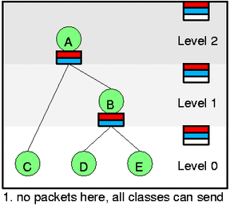
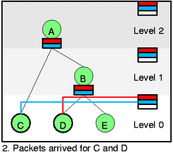
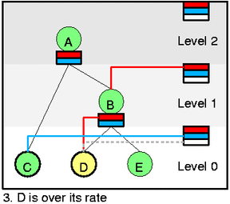
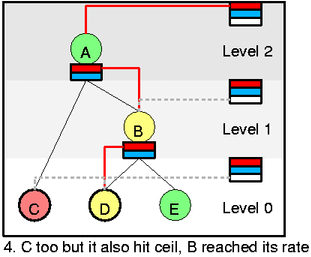
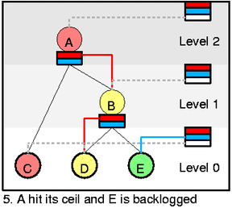
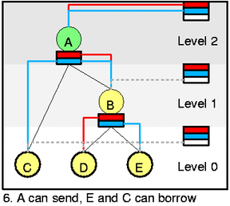

## 1. 定义

让我们来定义HTB的目标。首先是一些定义：

- Class：与Class有关的有，假设速率（assured rate AR），最高速率(ceil rate CR),优先级P，level和quantum Q。Class可以有父节点。还有实际速率R(actual rate)，代表数据包流离开该Class的速率，R每隔一小段时间就会测量一下。对于inner class，它们的R等于所有子孙节点的R的和。

- Leaf:没有子孙节点的class，只有leaf可以拥有数据包队列(packet queue)。

- Level：class的level决定了该class在分层（hierarchy）中的位置，叶子（Leaves）为level 0，根类(root classes)为LEVEL_COUNT-1，而inner class的level都比其父节点少一。可以看下图（LEVEL_COUNT=3 there）。

- Mode：class的mode是人为规定的值，由R、AR、和CR计算而来，可能的模式有：

  ```c
       Red: R > CR
       Yellow: R <= CR and R > AR
       Green: otherwise
  ```

- D(c)：将会列出所有数据包堆积叶子节点（backlogged leaves），这些数据包堆积叶子节点是c的子孙节点，而这些数据包堆积叶子节点的class和c都是yellow状态。换言之，会列出所有想要从c这个父节点borrow的c的叶子节点。

## 2. 链路共享的目标

由R，我们可以定义**链路共享**的目标。对于每个class c，它需要做到

```
Rc = min(CRc, ARc + Bc)        [eq1]
```

其中Bc表示从祖先节点（ancestors）借来的速率，它的定义如下

```c
/**
 * 对于[eq2]的解释
 * iff min[Pi over D(p)]>=Pc ： 当且仅当，p的所有需要借资源的子节点的优先级数值的最小值大于等于c的优先级数值，即在p中所有需要借资源的子节点中，c的优先级最高（包括一些节点优先级与c相等）。
 * 在以上情况下，Bc取值为，c的quantum 乘以 p的剩余速率的积，除以与c有相同优先级p叶子节点的个数（包括c）。
 */

/**
 * 对于[eq3]的解释
 * 当c的优先级不是D(p)中最高的时候，或没有p节点，或有level低于c的节点需要“借”，Bc=0
 */ 

             Qc Rp
Bc = -----------------------------  iff min[Pi over D(p)]>=Pc  [eq2]
     sum[Qi over D(p) where Pi=Pc]

Bc = 0   otherwise      [eq3]
```

其中`p`是`c`的父class。如果c没有父类，则Bc=0。对于Bc定义的`[eq2]`和`[eq3]`反应了优先级队列———当有优先级数值低于D(p)的backlogged descendants（即要向p借资源的子节点），那这些节点将被服务,而不是我们（these should be served, not us。就是说如果有level低于c的节点需要借用资源时，即使这个节点优先级比c低，也要先服务level更低的节点，而不是c）。上面的分式告诉我们，p的剩余速率（excess rate (Rp)）乘以Q，除以所有优先级与c相等的子节点的叶子类的个数，得到Bc。而p的剩余速率又由`[eq1]`和`[eq2]`共同定义，所以这是一个递归的过程。 说人话就是，当有class有需求且class的CR没有达到时，这些class的AR需要保持不变，而剩余带宽应该被所有相同的拥有最高优先级的叶子节点平分，而这个平分需要根据Q值来计算。

## 3. 辅助延迟目标

我们同样需要确保class的隔离性。所以一个class的速率改变，不应该影响到别的class的延迟，除非被影响的class正好向同一个祖先节点借了资源。而且，当class从同level祖先节点借资源时，高优先级的class的延期应该低于低优先级的class。

## 4. CBQ提示

从`参考[1]`中可以看到，HTB的目标是CBQ目标子集的更严格定义。所以如果我们满足了HTB的目标，那也肯定满足了CBQ的目标。因此HTB是CBQ的一种。

## 5. HTB调度

在这里，我经常会把Linux实现的特定函数或变量名称放在括号中，这将帮助你阅读源码。

在HTB调度（struct htb_sched）中有一棵class树(struct htb_class)。同时还有一个全局列表变量**self feed** list（htb_sched::row），它位于下图的最右边一列，self feed由self slot组成。每一个priority每一个level都有一个slot（one slot per priority per level）。因此在例子中有6个self slots（现在先忽略white slot，这里原文有错）。每一个self slot拥有一个class列表(list)——–list与class之间由彩色线条描述出对应关系。在同一个slot中的class拥有相同的level和相同的优先级。

self slot的列表中包含所有有“数据包堆积”的green class（由D(c)设定）。

每个inner class（非叶子class）都有**inner feed** slot（htb_class::inner.feed）。每一个priority（红-优先级高，蓝-优先级低）每一个inner class都有一个inner feed slot。与self slot一样，inner feed slot也有一个class列表（list），这些class有同样的优先级，而且这些class必须是slot的拥有者inner class的孩子节点。

inner slot的列表包含yellow children（由D(c)设定）。

 

**white slot**不是真正地属于self feed（在代码中），但是这样画更方便。white slot是**wait queue**,每一个level都有一个wait queue(htb_sched::wait_pq, htb_class::pq_node)。wait queue中包含所有该level中red或yellow的class。class根据wait time(这里可能原文有错)（htb_class::pq_key）进行存储，也根据wait time改变颜色（htb_class::mode），这是因为颜色的改变是异步的（asynchronous）。

可能你已经看到，如果我们能够把所有class放置在正确的list中，那么选择下一个数据包进行出队，会变得很简单。首先来看self feed list，选择一个最低level最高优先权（lowest level，highest prio）的非空slot（有连线的slot）。在图1.中没有这样的slot，所以没有数据包可以发送。在图2.中，level 0的red slot有class D,那么class D现在可以发送。

我们再仔细观察图1.图2.。在图1.中有“无数据包堆积叶子节点”（所有no backlogged leaf将会被细线圈绘制）,所以这里没有什么事情需求处理。在图2.中，class C和class D都有数据包到达，因此我们需要active这些class（htb_activate），而又因为他们都是green，所以我们直接将他们添加到适当的self slot中。出队操作将会首先选择class D，如果C包中的数据还没被清除，那么会继续选择C（不太可能，unlikely）。

 

我们假设D class（htb_dequeue_tree）中的数据包进行出队操作（dequeued，htb_dequeue），我们把这个包的大小称为漏桶（leaky bucket，htb_charge_class）。它迫使D改变它的速率并将颜色改为黄色。作为变化的一部分(htb_change_class_mode)，我们需要将D从self feed中删除（htb_deactivate_prios和htb_remove_class_from_row），并将D添加到B的inner feed（htb_activate_prios）中。同时也需要递归地将B添加到B所在level的self feed（htb_add_class_to_row）中。因为D在一段时间后会变回green，我们将D添加到level 0的priority event queue（while slot,htb_add_to_wait_tree）中。

接着，出队操作将选择C，即使C的优先权低于D。因为C位于更低的level,而根据`[eq2]`，我们应该首先服务level更低的class。这也是在直观上正确的解释——–当自己就可以发送时，为什么要“借”。

我们假设C出队，然后将状态改为red（达到ceil速率）。在这种状态下，C不能“借”。再假设D中的一些数据发送出去了，因此B改为yellow。现在你应该可以解释所有的步骤了：

- 1.将B从level 1的self feed list中移除
- 2.将B添加到level 1的wait queue
- 3.将A添加到level 2的self feed list
- 4.将B添加到A的inner feed list
- 5.将C添加到level 0的wait queue

现在你可以看清self和inner feed list是如何建立“借”路径的了。从图4.的线条中可以看出，从最顶端的self slot，下到D，所以D现在可以发送数据。

 

我们看一个更复杂的场景。A达到ceil，E开始堆积数据包(be backlogged)。C变回green。变化很细微琐碎，可以看到的是即使inner feed没有使用，它们也被维护着。看A的inner feed的蓝色部分（原文可能有错），从图6.中可以看到，多个class可以在同一个feed中。E和C可以同时进行出队操作。为确保`[eq2]`中Q的正确分配，也为了本状态的保持，我们需要应用DRR（Deficit Round Robin）和cycle对这两个class（C和E）进行操作。这说起来很简单，但是做起很难，我们下面详细分析。

依附于inner feed或self feed的class其实是一颗红黑树（rb-tree）。因此每个这样的list是根据classid来存储的。classid是一个该层次(hierarchy)中的常数。我们需要记住每个self slot list中的active class（htb_sched::ptr）,这样可以快速地找到叶子节点，从而进行出队操作。下一次树遍历（htb_lookup_leaf）将会把变化传播到树的上层（upper levels）。

你可能对为什么list按classid存储有疑问，原因很简单，DRR原理假设数据包堆积类（backlogged class）保持在同一个位置。只有DRR的拥有这个属性。在HTB中，class在list之间的迁移太频繁，这将对比率精度产生不利影响。

图6.中，3个类发生改变，A变green可以发送，而E和C变成yellow。最重要的一点是，inner class可能因为多个优先级slot（htb_class::prio_activity）变为active，而叶子class只有一个slot（htb_class::aprio）。所以你可以看到，red/blue线条对从A的self feed连接到A和B中，再分别到D和E。在图5.中也可以看到相似的现象。A以blue/low prio为C和B（即E）服务,如果这里D没有active，那么我们将从C和E之间，使用DRR计算对哪个class进行出队操作。

## 6. 实现细节

以上的图片应该足以帮助理解源码。但仍然有一些小提示。`htb_sched::row_mask[level] `表示哪个优先级在level上激活。比如图6.中，`row_mask = { 0,0,3 }`（row_mask[2]==3,因为优先级1和2都激活了，二进制11=十进制3，第一个1表示优先级2，第二个1表示优先级1，因为优先级数值越大，优先级越低，其中white slot不算），图3.中，`row_mask = { 2,1,0 }`（二进制，row_mask={10,01,00}）。这使得有激活资格的level更快地被找到。

htb_dequeue将所有待定的更改（pending changes）实施到将要出队的level的even queue(wait queue)中。这也是在每一层都有一个even queue的原因——–在图5.中，如果仅仅改变level 0的even queue，然后出队level 0就足够，那就不需要改变level 1和level 2中class的even queue状态。这是因为在更高level的优先级队列可以没有事件(no event)，这样可以防止更低level的拥有grenn class。

事件存在测试（event existence test）有一个捷径（short-circuit）。因为我们经常需要检测某个时间点是否有事件(event)，所以我为每一个level添加了`htb_sched::near_ev_cache`，cache中存储了以jiffy为时间单位的最近事件（nearest event）。快速测试已经能够满足。一般来说，能够达到10-30%速度的提升。

颜色在代码中称为模式（mode）：

```c
	0=Red=HTB_CANT_SEND
	1=Yellow=HTB_MAY_BORROW
	2=Green=HTB_CAN_SEND
```

由`htb_class_mode`计算是否为漏桶（leaky bucket）[参考2]。需要注意的是，有一个全局变量`HTB_HYSTERESIS`，它会将滞后的“burst”大小添加到模式计算（mode computation）中。这意味着更少的模式变化，可以得到15%的速度提升。

**Waitlist存在规则**。当class的mode不是`HTB_CAN_SEND (Green)`时，它将会被添加到waitlist中。

Linux qdisc应该支持显示drop请求。我增加了特殊的`htb_class::leaf`以能够做到drop请求。每一个优先级都有`drop_list`和`htb_sched::drops list`。对于给定的level，`drop_list`和`htb_sched::drops list`存储了所有的active class。当要drop的时候，我会从优先级最低的active list中选择。

HTB使用“真正的”DRR(定义域[参考4]中)。在linux中，CBQ使用的quantum可以小于MTU——–这更通用，但它的复杂度不再是O(1)。这意味着你必须使用正确的速度规模——>quantum转换，这样所有的quantum都会大于MTU。

## 7. Acknowledments

I’d like to say thanks to numerous people from Linux world who helped and motivated me a lot.

[1] Link-sharing and Resource Management models for Packet Networks, Sally Floyd and Van Jacobson, 1995 [2] Leaky Bucket, J. Turner, IEEE vol 24 1986 [3] HTB for Linux, http://luxik.cdi.cz/~devik/qos/htb [4] Efficient Fair Queuing using Deficit Round Robin, M. Shreedhar and G. Varghese [5] WF2Q: Worst-case Fair Weighted Fair Queuing, J.C.R. Bennet and Hui Zhang

## 参考

- *[Hierachical token bucket theory](http://luxik.cdi.cz/~devik/qos/htb/manual/theory.htm)*