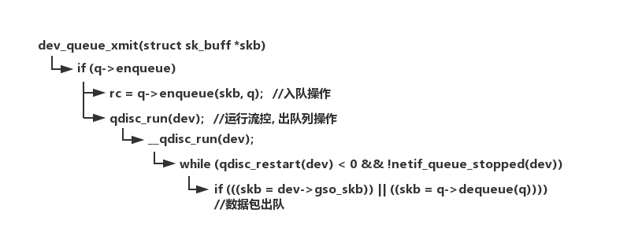
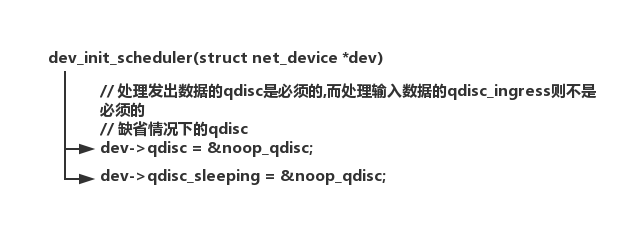
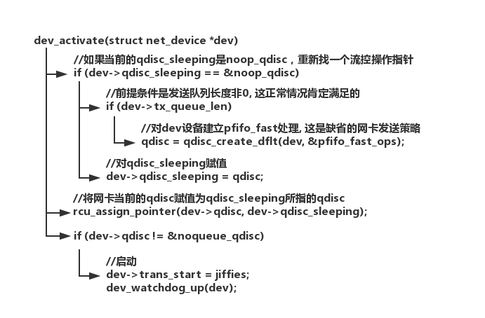

## 1. 输出流控

数据发出流控处理时，上层的所有处理已经完成，数据包已经交到网卡设备进行发送，在数据发送时进行相关的流控处理网络数据的出口函数为dev_queue_xmit()。

图1.输出流控流程： 

## 2. 网卡设备的qdisc初始化

本节先跟踪一下网卡设备的qdisc指针是如何被赋值的, 缺省赋值为何值。

在网卡设备的初始化函数register_netdevice()函数中调用dev_init_scheduler()函数对网卡设备的流控队列处理进行了初始化, 也就是说每个网络网卡设备的qdisc指针都不会是空的。

图2.qdisc初始化流程1—noop_qdisc 

当然noop_qdisc中的调度是不可用的, 只进行丢包处理；网卡在激活(dev_open)时会调用dev_activate()函数重新对qdisc指针赋值，但未对qdisc_ingress赋值。

图3.qdisc初始化流程2—qdisc重新赋值 

## 3. 数据结构

流控处理对外表现是一个黑盒，外部只能看到数据入队和出队，但内部队列是如何操作和管理外面是不知道的；另外处理队列处理外，流控还有一个调度器，该调度器将数据进行分类，然后对不同类型的数据采取不同的流控处理，所分的类型可能是多级的，形成一个树型的分类树。

流控的基本数据结构是struct Qdisc(queueing discipline，直译是“排队纪律”，意译为“流控”
)，这是内核中为数不多的以大写字母开头结构名称之一：

**3.1 Qdisc**

```c
/* include/net/sch_generic.h */
struct Qdisc  
{  
// 入队操作  
 int    (*enqueue)(struct sk_buff *skb, struct Qdisc *dev);  
// 出队操作  
 struct sk_buff * (*dequeue)(struct Qdisc *dev);  
// 标志  
 unsigned  flags;  
#define TCQ_F_BUILTIN 1  
#define TCQ_F_THROTTLED 2  
#define TCQ_F_INGRESS 4  
 int   padded;  
// Qdisc的基本操作结构  
 struct Qdisc_ops *ops;  
// 句柄  
 u32   handle;  
 u32   parent;  
 atomic_t  refcnt;  
// 数据包链表头  
 struct sk_buff_head q;  
// 网卡设备  
 struct net_device *dev;  
 struct list_head list;  
// 统计信息  
 struct gnet_stats_basic bstats;  
 struct gnet_stats_queue qstats;  
// 速率估计  
 struct gnet_stats_rate_est rate_est;  
// 流控锁  
 spinlock_t  *stats_lock;  
 struct rcu_head  q_rcu;  
 int   (*reshape_fail)(struct sk_buff *skb,  
     struct Qdisc *q);  
 /* This field is deprecated, but it is still used by CBQ 
  * and it will live until better solution will be invented. 
  */  
// 父节点, 但基本已经被淘汰了  
 struct Qdisc  *__parent;  
};  
```

**3.2 流控队列的基本操作结构**

```c
struct Qdisc_ops  
{  
// 链表中的下一个  
 struct Qdisc_ops *next;  
// 类别操作结构  
 struct Qdisc_class_ops *cl_ops;  
// Qdisc的名称, 从数组大小看应该就是网卡名称  
 char   id[IFNAMSIZ];  
// 私有数据大小  
 int   priv_size;  
// 入队  
 int    (*enqueue)(struct sk_buff *, struct Qdisc *);  
// 出队  
 struct sk_buff * (*dequeue)(struct Qdisc *);  
// 将数据包重新排队  
 int    (*requeue)(struct sk_buff *, struct Qdisc *);  
// 丢弃  
 unsigned int  (*drop)(struct Qdisc *);  
// 初始化  
 int   (*init)(struct Qdisc *, struct rtattr *arg);  
// 复位为初始状态,释放缓冲,删除定时器,清空计数器  
 void   (*reset)(struct Qdisc *);  
// 释放  
 void   (*destroy)(struct Qdisc *);  
// 更改Qdisc参数  
 int   (*change)(struct Qdisc *, struct rtattr *arg);  
// 输出  
 int   (*dump)(struct Qdisc *, struct sk_buff *);  
 int   (*dump_stats)(struct Qdisc *, struct gnet_dump *);  
 struct module  *owner;  
}; 
```

**3.3 流控队列类别操作结构**

```c
struct Qdisc_class_ops  
{  
 /* Child qdisc manipulation */  
// 减子节点  
 int   (*graft)(struct Qdisc *, unsigned long cl,  
     struct Qdisc *, struct Qdisc **);  
// 增加子节点  
 struct Qdisc *  (*leaf)(struct Qdisc *, unsigned long cl);  
 /* Class manipulation routines */  
// 获取, 增加使用计数  
 unsigned long  (*get)(struct Qdisc *, u32 classid);  
// 释放, 减少使用计数  
 void   (*put)(struct Qdisc *, unsigned long);  
// 改变  
 int   (*change)(struct Qdisc *, u32, u32,  
     struct rtattr **, unsigned long *);  
// 删除  
 int   (*delete)(struct Qdisc *, unsigned long);  
// 遍历  
 void   (*walk)(struct Qdisc *, struct qdisc_walker * arg);  
 /* Filter manipulation */  
 struct tcf_proto ** (*tcf_chain)(struct Qdisc *, unsigned long);  
// tc捆绑  
 unsigned long  (*bind_tcf)(struct Qdisc *, unsigned long,  
     u32 classid);  
// tc解除  
 void   (*unbind_tcf)(struct Qdisc *, unsigned long);  
 /* rtnetlink specific */  
// 输出  
 int   (*dump)(struct Qdisc *, unsigned long,  
     struct sk_buff *skb, struct tcmsg*);  
 int   (*dump_stats)(struct Qdisc *, unsigned long,  
     struct gnet_dump *);  
};  
```

**3.4 流控速率控制表结构**

```c
struct qdisc_rate_table  
{  
 struct tc_ratespec rate;  
 u32  data[256];  
 struct qdisc_rate_table *next;  
 int  refcnt;  
}; 
```

## 4. 基本操作

各种流控算法是通过流控操作结构（Qdisc_ops）实现，然后这些操作结构登记到内核的流控链表，在使用时可为网卡构造新的流控结构，将该结构和某种流控操作结构挂钩，这样就实现网卡采用某种策略发送数据进行流控，所有操作在用户空间都可通过tc程序设置。

### 4.1 Qdisc的一些基本操作

**4.1.1 分配新的流控结构**

**qdisc_alloc**

```c
/* net/sched/sch_generic.c */  
// 分配新的Qdisc结构, Qdisc的操作结构由函数参数指定 
struct Qdisc *qdisc_alloc(struct net_device *dev, struct Qdisc_ops *ops)  
{  
 void *p;  
 struct Qdisc *sch;  
 unsigned int size;  
 int err = -ENOBUFS;  
 /* ensure that the Qdisc and the private data are 32-byte aligned */  
// Qdisc空间按32字节对齐  
 size = QDISC_ALIGN(sizeof(*sch));  
// 增加私有数据空间  
 size += ops->priv_size + (QDISC_ALIGNTO - 1);  
 p = kzalloc(size, GFP_KERNEL);  
 if (!p)  
  goto errout;  
// 确保从缓冲区中的sch到缓冲区结束点空间是32字节对齐的  
 sch = (struct Qdisc *) QDISC_ALIGN((unsigned long) p);  
// 填充字节的数量  
 sch->padded = (char *) sch - (char *) p;  
//  +------------------------------------+  
//  |________|___________________________|  
//  ^        ^                           ^  
//  |  pad   | <------ 32*N ------------>|  
//  p        sch                           
  
// 初始化链表, 将用于挂接到dev的Qdisc链表  
 INIT_LIST_HEAD(&sch->list);  
// 初始化数据包链表  
 skb_queue_head_init(&sch->q);  
// Qdisc结构参数  
 sch->ops = ops;  
 sch->enqueue = ops->enqueue;  
 sch->dequeue = ops->dequeue;  
 sch->dev = dev;  
// 网卡使用计数增加  
 dev_hold(dev);  
 sch->stats_lock = &dev->queue_lock;  
 atomic_set(&sch->refcnt, 1);  
 return sch;  
errout:  
 return ERR_PTR(-err);  
}  
```

**qdisc_create_dflt**

调用`qdisc_alloc`的一个实例，创建default qdisc，`new_q = qdisc_create_dflt(sch->dev, &pfifo_qdisc_ops);`。

```c
struct Qdisc * qdisc_create_dflt(struct net_device *dev, struct Qdisc_ops *ops)  
{  
 struct Qdisc *sch;  
// 分配Qdisc结构   
 sch = qdisc_alloc(dev, ops);  
 if (IS_ERR(sch))  
  goto errout;  
// 如果没有初始化函数或者初始化成功, 返回Qdisc结构  
 if (!ops->init || ops->init(sch, NULL) == 0)  
  return sch;  
// 初始化失败, 释放Qdisc  
 qdisc_destroy(sch);  
errout:  
 return NULL;  
}  
```

还有很多操作，就不详细列出了，具体了解到[Linux内核中流量控制(1)](http://cxw06023273.iteye.com/blog/867318)，分别为：

- `qdisc_reset`:调用Qdisc操作函数中的reset函数
- `qdisc_destroy`:释放Qdisc
- `qdisc_enqueue_tail`:将skb包添加到数据队列最后
- `qdisc_dequeue_head`:将队列头的数据包出队列
- `qdisc_dequeue_tail`:将队列尾的数据包出队列
- `qdisc_reset_queue`:复位Qdisc队列
- `qdisc_queue_drop`:丢弃Qdisc数据队列尾的数据包
- `qdisc_drop`:丢弃数据包
- `qdisc_reshape_fail`:整形失败丢包
- `qdisc_lookup`:根据句柄查找Qdisc, 句柄是个32位整数用于标识Qdisc的
- `qdisc_leaf`:返回指定类别的Qdisc叶节点
- `qdisc_graft`:”嫁接”Qdisc, 将新的Qdisc节点添加到父节点作为叶节点
- `dev_graft_qdisc`:将qdisc作为顶层Qdisc节点附着于dev设备
- `qdisc_create`:在指定的网卡设备上创建新的Qdisc结构
- `qdisc_alloc_handle`:分配新句柄
- `qdisc_change`:修改Qdisc参数

### 4.2 Qdisc操作结构(Qdisc_ops)的一些基本操作

- `register_qdisc(struct Qdisc_ops *qops)`:登记Qdisc操作结构, 每种排队算法都是通过Qdisc操作结构(Qdisc_ops)实现的
- `unregister_qdisc`:拆除Qdisc操作结构
- `qdisc_lookup_ops`:根据名称查找;流控操作结构

## 参考

- *[Linux内核中流量控制(1)](http://cxw06023273.iteye.com/blog/867318)*