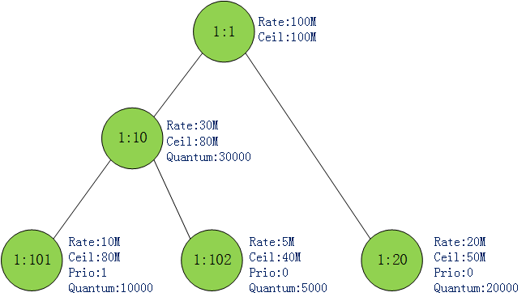
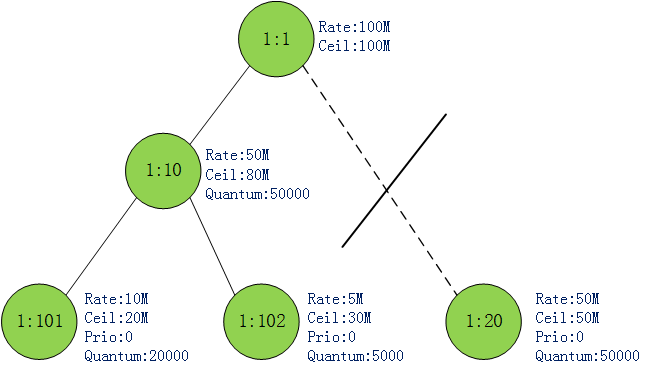
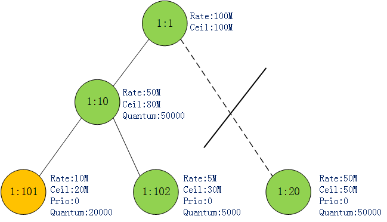
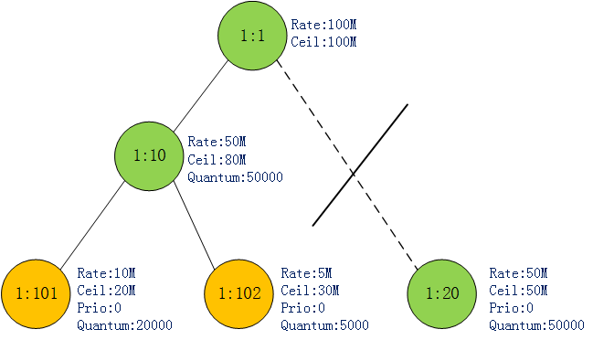
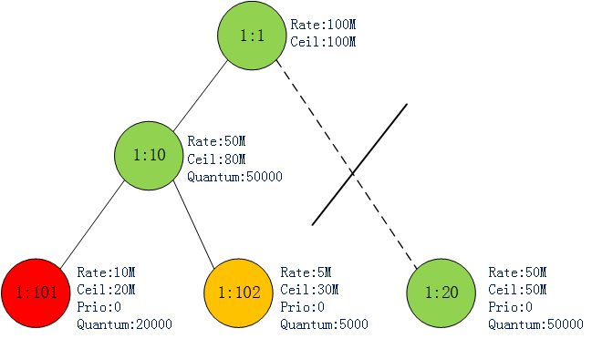
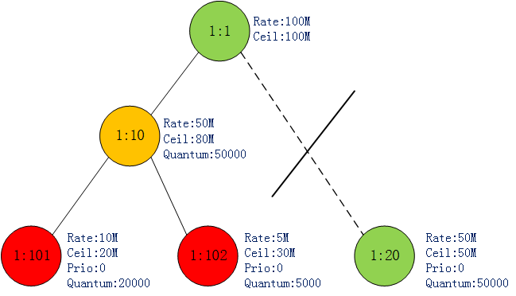

# [linux网络流控-htb算法简析](https://www.cnblogs.com/acool/p/7779159.html)

项目中用tc,htb做流控期间,研究了htb(分层令牌桶)算法的实现.觉得这种思想在类似与有消费优先级的生产者消费者场景中也很适用.
该算法过于复杂,碍于嘴拙遂在标题中加了简析,只介绍核心思想和关键代码的实现.

**一个栗子:**

```
tc qdisc add dev eth0 root handle 1: htb
tc class add dev eth0 parent 1:  classid 1:1  htb rate 100mibps
tc class add dev eth0 parent 1:1 classid 1:10 htb rate 30mibps ceil 80mibps prio 0 burst 10kbit cburst 20kbit quantum 30000
tc class add dev eth0 parent 1:1 classid 1:20 htb rate 20mibps ceil 50mibps prio 1 burst 10kbit cburst 20kbit quantum 20000
tc class add dev eth0 parent 1:10 classid 1:101 htb rate 10mibps ceil 80mibps prio 1 burst 10kbit cburst 20kbit quantum 10000
tc class add dev eth0 parent 1:10 classid 1:102 htb rate 5mibps ceil 40mibps prio 0 burst 10kbit cburst 20kbit quantum 5000
```





首先创建了一个htb队列,在队列中创建了5个类,他们之间的关系可以表示成上图这样的一棵树.一些关键参数也标出来了,后面会解释.


下面用iptables将流量分类,根据目的ip,将相应的流量分类到1:20 1:101 1:102三个类队列中.这里有两点要说明:
　　1.分类流量又很多方式,例如cgroup iptables tc filter等工具.但本文中重心在于流量如何出,所以网络包如何进入相应的类队列就省略了.
　　2.流量只能缓存在树的叶节点(leaf class),其他类节点(inner class)是不能缓存流量的.但innerclass对于不同子类能共享带宽起到重要作用.

```
iptables -t mangle -A OUTPUT -d 192.168.1.2 -j CLASSIFY --set-class 1:20
iptables -t mangle -A OUTPUT -d 192.168.1.3 -j CLASSIFY --set-class 1:101
iptables -t mangle -A OUTPUT -d 192.168.1.4 -j CLASSIFY --set-class 1:10
```


htb虽然为每个类设定了rate,但并不是说每个类只能以设定的rate出包.当网卡比较空闲时,leafclass是可以以高于rate的速率出包的.但不能高于ceil.一句话来说就是闲时共享,忙时按照比例(这个比例是rate,quantum共同决定的)分配带宽.网络包只能入/出leafclass,innerclass对于不同子类能共享带宽起作用.
图1中还为每个leafclass标注出了priority属性.htb对类支持0-7 8个优先级,0优先级最高.优先级越高的类可以优先出流量.

**原理介绍**
某个时刻每个类可以处于三种状态中的一种:

　　**CAN_SEND**(令牌充足的,发送的网络包小于rate,例图中用绿色表示) 

　　**MAY_BORROW**(没有令牌,但可借用.发送的网络包大于rate小于ceil,例图中用黄色表示)

　　**CANT_SEND**(没有令牌不可借用,发送的网络包大于ceil,例图中用红色表示)

htb是如何决策哪个类出包的？
1.htb算法从类树的底部开始往上找CAN_SEND状态的class.如果找到某一层有CAN_SEND状态的类则停止.


2.如果该层中有多个class处于CAN_SEND状态则选取优先级最高(priority最小)的class.如果最高优先级还是有多个class,那就在这些类中轮训处理.每个类每发送自己的quantum个字节后,轮到下一个类发送.

3.上面有讲到只有leafclass才可以缓存网络包,innerclass是没有网络包的.如果步骤1,2最终选到了innerclass怎么处理？既然是innerclass,肯定有自己的subclass.innerclass会顺着树往下找,找到一个子孙leafclass.并且该leafclass处于MAY_BORROW状态,将自己富余的令牌借给该leafclass让其出包.同样的道理,可能会有多个子孙leafclass处于MAY_BORROW状态,这里的处理跟步骤2是一样的.

多个子类共享父类带宽也就体现在这里了.假设父类富余了10MB, 子类1的quantum为30000,子类2的quantum为20000.那么父类帮子类1发送30000byte,再帮子类2发送20000byte.依次循环.最终效果就是子类1借到了6MB,子类2借到了4MB.因此上文说,当子类之间共享带宽时,rate/quantum共同决定它们分得的带宽.rate处于CAN_SEND状态时能发送多少字节,quantum决定处于MAY_BORROW状态时可借用令牌发送多少字节.

**场景举例**
1.假设某一时刻,1:101, 1:102都有网络包堆积,并且都处于CAN_SEND状态.1:20因为没有流量因此可视为没有这个节点.图2所示:


按照前面说的,1:101, 1:102这两个类都属于同一层,优先级相同.htb轮训它们出包.1:101每轮发送20000byte,1:102每轮发送5000byte.
某一时刻1:101发送的流量超过了其rate值(10MB),但未超过其ceil值(20MB).因此1:101状态转变成MAY_BORROW状态.如图3:




此时最底层只有1:102这个类是CAN_SEND,只能全力出这个类的包了.当1:102发送的流量超过其rate值(5MB)时,其状态也变为MAY_BORROW.如图4:




这时最底层已经没有CAN_SEND状态的类了.网上找到1:10.1:10的两个子类此时都处于MAY_BORROW状态,因此1:10又轮训着发送1:101,1:102的包.每轮还是发送它们对应的quantum值. 很快1:101发送的流量达到其ceil值(20MB)了,此时1:101状态变成CANT_SEND.如图5:



此时1:10只能全力发送1:102的包.直到达到其ceil值(30MB).此时1:102变为CANT_SEND,1:101和1:102累计发送了50MB数据,达到了其父类1:10的rate值,因此1:10变为MAY_BORROW.如图6:



**核心代码**
几个核心数据结构,这里就不贴了:
struct Qdisc: tc队列
struct htb_class: htb类
网络包从协议栈出来经驱动送往网卡之前,会做一个入队/出队操作.这也就是tc的入口.
当我们使用htb算法时,出包回调为htb_dequeue,htb_dequeue返回一个skb给网卡发送.

```c
static struct sk_buff *htb_dequeue(struct Qdisc *sch)
{
    ...
    for(level = 0; level < TC_HTB_MAXDEPTH; level++) {   // 逐层找.这里level是反的,0层表示最底层.
        /* common case optimization - skip event handler quickly */
        int m;
        ...
        m = ~q->row_mask[level];
        while(m !=(int)(-1)) {        // 同一层取优先级高的
            int prio = ffz(m);
            m |= 1 << prio;
            skb = htb_dequeue_tree(q, prio, level);   //出包
            if(likely(skb != NULL)) {
                sch->q.qlen--;
                sch->flags &= ~TCQ_F_THROTTLED;
                goto fin;
            }
        }
    }
    sch->qstats.overlimits++;
    ...
fin:
    return skb;
}
```

htb_dequeue找到对应的层数和优先级之后调用htb_dequeue_tree,只列出htb_dequeue_tree中核心代码:

```c
static struct sk_buff *htb_dequeue_tree(struct htb_sched *q, int prio, int level)
{
    struct sk_buff *skb = NULL;
    struct htb_class *cl, *start;
    ...
    cl = htb_lookup_leaf(q->row[level] + prio,prio, q->ptr[level] + prio,  // 找到该level 该priority下的一个leafclass
                   q->last_ptr_id[level] + prio);

    skb = cl->un.leaf.q->dequeue(cl->un.leaf.q);     // 出包

    if(likely(skb != NULL)) {
        cl->un.leaf.deficit[level] -= qdisc_pkt_len(skb);  //deficit[level] 扣掉该包的byte数
        if(cl->un.leaf.deficit[level] < 0) {              //当deficit[level]<0时说明该类已经发送了quantum.需要发送下一个类了.
            cl->un.leaf.deficit[level] += cl->quantum;
            htb_next_rb_node((level ? cl->parent->un.inner.ptr : q->
                      ptr[0]) + prio);
        }
        htb_charge_class(q, cl, level, skb);    // 更新令牌.
    }
    return skb;
}
```

因为不确定传进来的level是不是最底层,因此调用htb_lookup_leaf保证得到的class是leafclass.其中参数(q->ptr[level] + prio)记录该层该优先级当前应该发那个leafclass.
skb = cl->un.leaf.q->dequeue(cl->un.leaf.q) 出包.

当出队一个数据包时,类对应的deficit[level]扣减包的byte数,当deficit[level]<0时说明该类已经发送了quantum.于是虽然再次给deficit[level]加了quantum,
但是htb_next_rb_node((level ? cl->parent->un.inner.ptr : q->ptr[0]) + prio)已经将该层该优先级的出包类指针指向下一个类了.下发出包,将会出另一个类.
可以对比前面提到的1:101,1:102轮流出包.

htb_charge_class最后更新令牌.看下htb_charge_class:


```c
static void htb_charge_class(struct htb_sched *q, struct htb_class *cl,int level, struct sk_buff *skb)
{
    int bytes = qdisc_pkt_len(skb);
    enum htb_cmode old_mode;
    long diff;

    while(cl) {        //这里是一个循环,子类发包,是同时要扣子类和父类的令牌的.
        diff = psched_tdiff_bounded(q->now, cl->t_c, cl->mbuffer);
        if(cl->level >= level) {
            if(cl->level == level)         //令牌的生产,扣减在这里.
                cl->xstats.lends++;
            htb_accnt_tokens(cl, bytes, diff);
        } else {
            cl->xstats.borrows++;
            cl->tokens += diff; /* we moved t_c; update tokens */
        }
        htb_accnt_ctokens(cl, bytes, diff);
        cl->t_c = q->now;

        old_mode = cl->cmode;
        diff = 0;
        htb_change_class_mode(q, cl, &diff);        //判断是不是要切换状态了.
        if(old_mode != cl->cmode) {
            if(old_mode != HTB_CAN_SEND)
                htb_safe_rb_erase(&cl->pq_node, q->wait_pq + cl->level);
            if(cl->cmode != HTB_CAN_SEND)
                htb_add_to_wait_tree(q, cl, diff);
        }
        cl = cl->parent;
    }
}
```

子类发包同时要口父类的令牌很好理解,本质上子机就是再用父类的带宽.但是当父类令牌富余借给子机出包时,只需从父类开始到祖先扣令牌.子机会更新这个周期生产的令牌,但不会扣了,因为是借用父类的令牌发包的.
令牌计算完后,更改class的状态.大体上就是这样,不再深入了.

为了描述方便,有些地方写的跟代码细节有差别.见谅.

go go go！